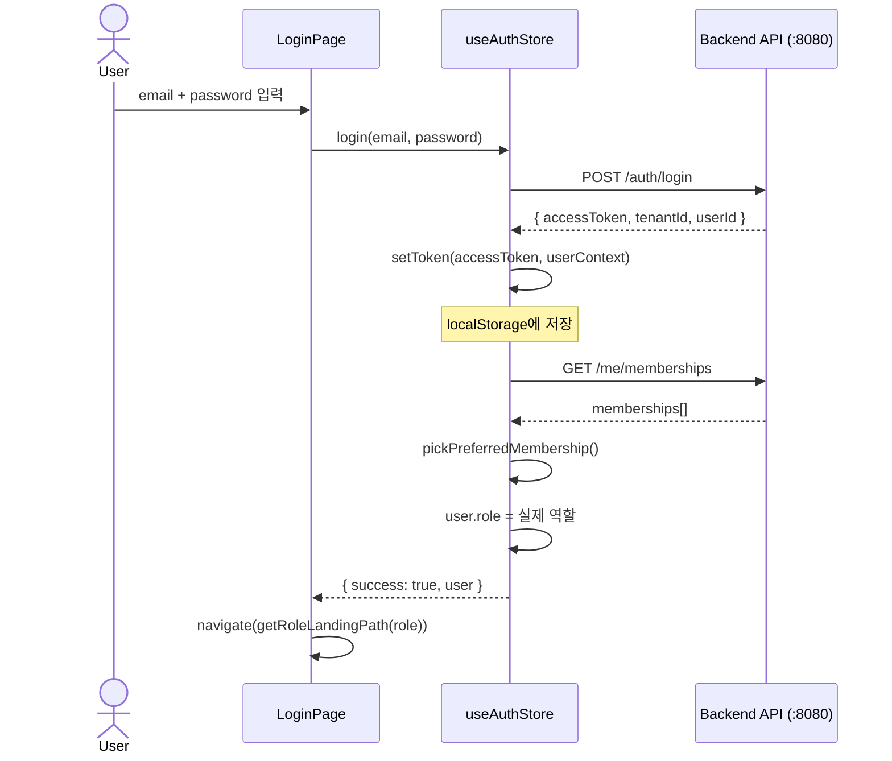
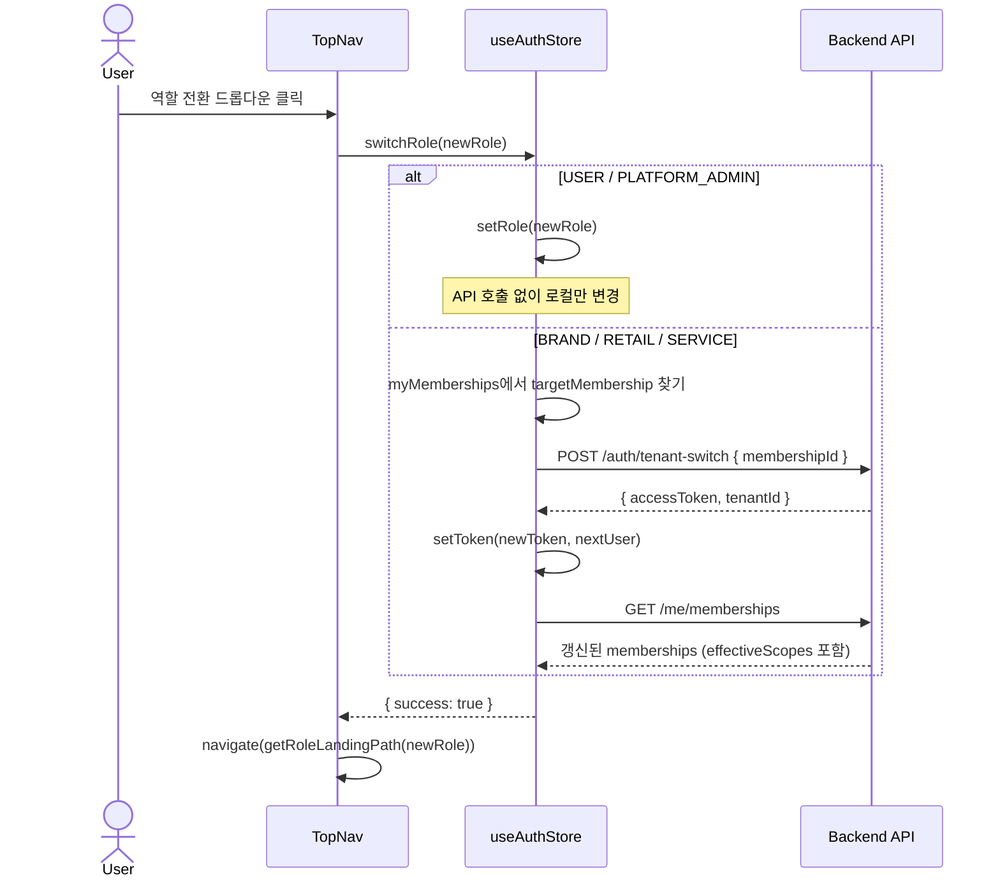
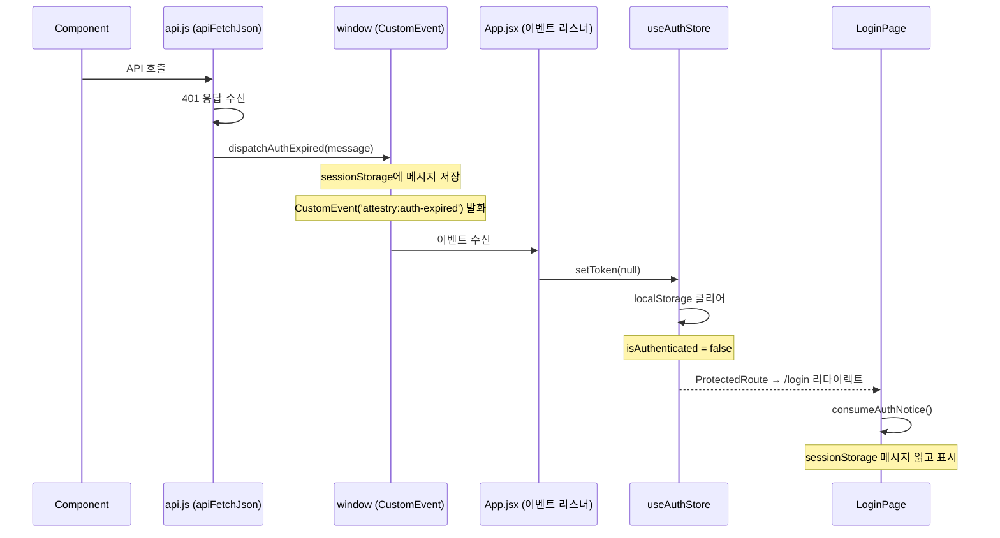
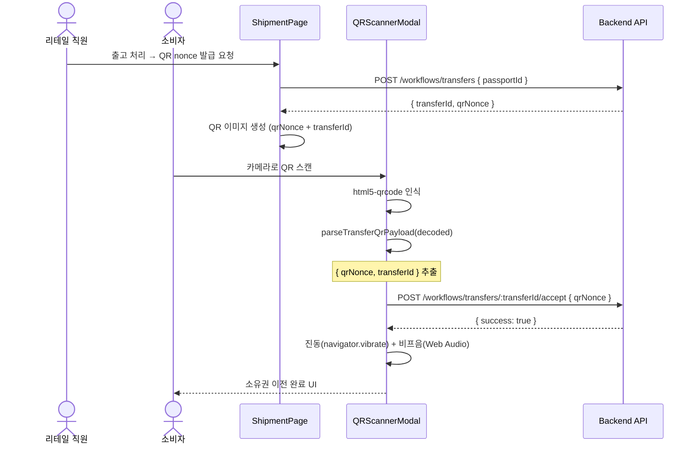
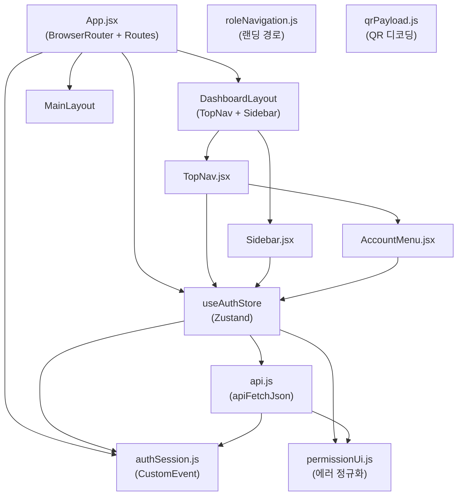
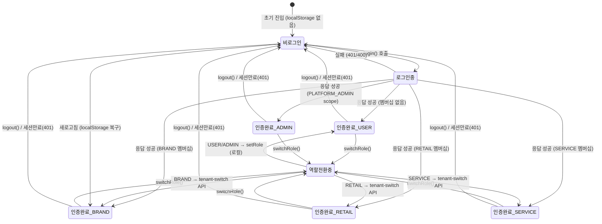

# Attestry Frontend Complete Guide

> **버전:** v2.0 — 전 대상(경영진·PM·QA·백엔드·프론트·DevOps) 완전 커버 최종판
> **최종 수정:** 2026-03-15
> **대상 코드베이스:** `/attestry_front` (React 19 + Vite 8 + Zustand 5 + Tailwind CSS 4)
> **문서 규모:** ~3,200줄 · 26개 섹션 완전 가이드

---

## 독자별 빠른 시작 가이드

> **이 문서는 3,200줄+입니다. 전부 읽지 않아도 됩니다. 본인 역할에 맞는 섹션만 읽으세요.**

| 독자 | 권장 읽기 순서 |
|------|--------------|
| **백엔드 개발자** | §1 → §5 → §6 → §7 → §13 → §20 → §15 |
| **프론트엔드 학습자** | §1 → §2 → §3 → §4 → §5 → §8 → §10 → §11 |
| **발표자 / 면접자** | §25 → §1 → §15 → §24 → §17 |
| **QA** | §1 → §4 → §7 → §21 → §20 → §16 |
| **PM / 기획자** | §1 → §19 → §10 → §25 → §16 |
| **DevOps / 운영** | §22 → §14 → §12 → §23 |
| **경영진 / 투자자** | **§25 Executive Summary** → §19 사용자 여정 → §1 개요 |
| **팀 신규 합류** | §14 개발환경 → §3 폴더구조 → §1 개요 → §4 라우팅 |

---

## 목차

- [1. 프로젝트 개요](#1-프로젝트-개요)
- [2. 기술 스택](#2-기술-스택)
- [3. 폴더 구조](#3-폴더-구조)
- [4. 라우팅 구조](#4-라우팅-구조)
  - ↳ 4.1 레이아웃 분기
  - ↳ 4.2 전체 라우트 맵
  - ↳ 4.3 ProtectedRoute & DashboardRedirector
- [5. 상태 관리 (Zustand)](#5-상태-관리-zustand)
  - ↳ 5.1 스토어 구조
  - ↳ 5.2 세션 초기화 흐름
  - ↳ 5.3 역할 전환 (switchRole)
  - ↳ 5.4 멤버십 해석 로직
- [6. API 통신 레이어](#6-api-통신-레이어)
  - ↳ 6.1 apiFetchJson
  - ↳ 6.2 응답 언래핑 (unwrapApiResponse)
  - ↳ 6.3 에러 정규화
- [7. 인증 & 세션 시스템](#7-인증--세션-시스템)
  - ↳ 7.1 토큰 저장 전략
  - ↳ 7.2 세션 만료 이벤트 시스템
  - ↳ 7.3 로그인 전체 흐름
- [8. 역할(Role) & 권한(Permission) 시스템](#8-역할role--권한permission-시스템)
  - ↳ 8.1 역할 종류
  - ↳ 8.2 Scope 기반 세밀 권한
  - ↳ 8.3 역할별 랜딩 경로
  - ↳ 8.4 역할별 사이드바 메뉴
- [9. 레이아웃 구조](#9-레이아웃-구조)
- [10. 페이지별 상세 설명](#10-페이지별-상세-설명)
  - ↳ 10.1 인증 (Login / Signup)
  - ↳ 10.2 공개 패스포트 뷰
  - ↳ 10.3 소유권 이전 수락
  - ↳ 10.4 브랜드 대시보드
  - ↳ 10.5 리테일 대시보드
  - ↳ 10.6 서비스 대시보드
  - ↳ 10.7 플랫폼 어드민
  - ↳ 10.8 온보딩
  - ↳ 10.9 마이페이지
- [11. QR 코드 시스템](#11-qr-코드-시스템)
  - ↳ 11.1 공개 패스포트 QR
  - ↳ 11.2 소유권 이전 QR
  - ↳ 11.3 Transfer Code 포맷 (TR1 / TR2)
- [12. Vite 프록시 설정](#12-vite-프록시-설정)
- [13. 커스텀 디자인 시스템 (tracera-*)](#13-커스텀-디자인-시스템-tracera-)
- [14. 로컬 개발환경 설정](#14-로컬-개발환경-설정)
- [15. 프론트엔드 기술 차별점](#15-프론트엔드-기술-차별점)
- [16. FAQ](#16-faq)
- [17. 발표 예상 Q&A](#17-발표-예상-qa)
- [18. Mermaid 다이어그램](#18-mermaid-다이어그램)
  - ↳ 18.1 전체 시스템 아키텍처
  - ↳ 18.2 로그인 시퀀스
  - ↳ 18.3 역할 전환 시퀀스
  - ↳ 18.4 세션 만료 시퀀스
  - ↳ 18.5 소유권 이전 시퀀스
  - ↳ 18.6 컴포넌트 의존성 다이어그램
  - ↳ 18.7 인증 상태 전이 다이어그램
- [19. 사용자 여정 맵](#19-사용자-여정-맵)
  - ↳ 19.1 소비자(USER) 여정
  - ↳ 19.2 브랜드(BRAND) 여정
  - ↳ 19.3 리테일(RETAIL) 여정
  - ↳ 19.4 서비스(SERVICE) 여정
  - ↳ 19.5 플랫폼 관리자 여정
  - ↳ 19.6 신규 업체 온보딩 여정
- [20. 핵심 API 요청/응답 명세](#20-핵심-api-요청응답-명세)
  - ↳ 20.1 인증 API
  - ↳ 20.2 멤버십 API
  - ↳ 20.3 제품/패스포트 API
  - ↳ 20.4 소유권 이전 API
  - ↳ 20.5 원장 API
  - ↳ 20.6 온보딩 API
  - ↳ 20.7 파트너 링크 API
- [21. QA 완전 체크리스트](#21-qa-완전-체크리스트)
  - ↳ 21.1 인증/세션
  - ↳ 21.2 역할/권한
  - ↳ 21.3 라우팅 보호
  - ↳ 21.4 QR 코드
  - ↳ 21.5 에러 처리
  - ↳ 21.6 반응형/UX
  - ↳ 21.7 API 동작 매트릭스
- [22. 배포 & 운영](#22-배포--운영)
  - ↳ 22.1 빌드 절차
  - ↳ 22.2 환경별 설정
  - ↳ 22.3 Nginx 정적 배포
  - ↳ 22.4 Docker 빌드
  - ↳ 22.5 모니터링 포인트
- [23. 성능 & 확장성](#23-성능--확장성)
  - ↳ 23.1 번들 최적화
  - ↳ 23.2 렌더링 최적화
  - ↳ 23.3 API 호출 최적화
  - ↳ 23.4 확장 포인트
- [24. 아키텍처 결정 이력 (ADR)](#24-아키텍처-결정-이력-adr)
- [25. Executive Summary (경영진·투자자)](#25-executive-summary-경영진투자자)
- [26. 파일 위치 빠른 참조 (부록)](#26-파일-위치-빠른-참조-부록)
- [문서 변경 이력](#문서-변경-이력)

---

# 1. 프로젝트 개요

Attestry 프론트엔드는 **디지털 제품 여권(DPP) B2B SaaS 플랫폼**의 웹 클라이언트입니다.

하나의 React SPA가 **5가지 역할**의 완전히 다른 대시보드를 동시에 서비스합니다:

| 역할 | 설명 | 랜딩 경로 |
|------|------|----------|
| `USER` (일반 소비자) | 제품 소유권 확인, 이전 수락 | `/` |
| `BRAND` (브랜드) | 제품 발행, 출고, 유통 위임 | `/brand/products` |
| `RETAIL` (리테일/소매점) | 보유 제품 관리, 소유권 이전 | `/retail/inventory` |
| `SERVICE` (서비스 제공자) | A/S 요청 처리, 이력 관리 | `/service/requests` |
| `PLATFORM_ADMIN` | 업체 승인, 플랫폼 권한 관리 | `/admin/onboarding` |

**핵심 특징:**
- 로그인한 사용자가 여러 역할(BRAND + USER 동시)을 가질 수 있음
- 역할 전환 시 백엔드 `/auth/tenant-switch` API 호출 + 새 토큰 발급
- 공개 패스포트 페이지는 비로그인 상태에서도 제품 원장 열람 가능
- QR 스캔으로 현장에서 소유권 이전 완료 (카메라 + 진동 + 사운드 피드백)

---

# 2. 기술 스택

```
React        19.2    — 최신 React (Concurrent Features, useTransition 등 활성화)
React Router 7.13    — Data Router, Nested Routes, NavLink activeStyle
Zustand      5.0     — 경량 전역 상태관리 (Context/Redux 대체)
Tailwind CSS 4.2     — PostCSS 없이 Vite 플러그인으로 통합 (config 파일 불필요)
Vite         8.0     — 개발서버 + 번들러 (HMR 초고속, Proxy 내장)
lucide-react 0.577   — 아이콘 라이브러리
qrcode.react 4.2     — QR 이미지 생성 (SVG/Canvas)
html5-qrcode 2.3     — 카메라 QR 스캐너
qrcode       1.5     — 서버사이드 스타일 QR DataURL 생성
```

**왜 이 스택인가?**

| 선택 | 이유 |
|------|------|
| React 19 | Concurrent Mode 기본 활성화, `useTransition` 없이도 렌더 중단 최적화 |
| Zustand (Redux 아님) | 보일러플레이트 없음, localStorage 연동이 단순함, devtools 지원 |
| Tailwind v4 | CSS 변수 기반 새 엔진, `@layer components`로 디자인 시스템 구성 용이 |
| Vite proxy | 개발 환경에서 CORS 없이 백엔드(8080) + ledger(8081) 동시 연결 |

---

# 3. 폴더 구조

```
attestry_front/
├── src/
│   ├── App.jsx                    # 라우터 루트, ProtectedRoute, DashboardRedirector
│   ├── main.jsx                   # React DOM 마운트 (StrictMode)
│   ├── index.css                  # 글로벌 CSS + tracera-* 디자인 시스템
│   │
│   ├── store/
│   │   └── useAuthStore.js        # Zustand 전역 스토어 (인증, 멤버십, 권한 전체)
│   │
│   ├── utils/
│   │   ├── api.js                 # fetch 래퍼, 응답 언래핑, 에러 정규화
│   │   ├── authSession.js         # 세션 만료 이벤트 (CustomEvent 시스템)
│   │   ├── permissionUi.js        # 스코프 체크, 에러 → 한국어 메시지 변환
│   │   ├── roleNavigation.js      # 역할별 랜딩 경로 맵
│   │   └── qrPayload.js           # QR 디코딩 (패스포트ID / 이전 페이로드)
│   │
│   ├── components/
│   │   ├── layout/
│   │   │   ├── DashboardLayout.jsx  # 대시보드 레이아웃 (TopNav + Sidebar + Outlet)
│   │   │   ├── MainLayout.jsx       # 공개 레이아웃 (Outlet만, 인증 불필요)
│   │   │   ├── Sidebar.jsx          # 역할별 사이드바 (SIDEBAR_MENUS)
│   │   │   ├── TopNav.jsx           # 상단 네비 (역할 전환, 로그아웃)
│   │   │   ├── AccountMenu.jsx      # 계정 메뉴 드롭다운
│   │   │   └── TraceraLogo.jsx      # 로고 컴포넌트
│   │   └── shipment/
│   │       └── QRScannerModal.jsx   # html5-qrcode 기반 카메라 스캐너 모달
│   │
│   └── pages/
│       ├── auth/
│       │   ├── LoginPage.jsx
│       │   └── SignupPage.jsx
│       ├── main/          MainPage.jsx
│       ├── onboarding/    OnboardingView.jsx      (업체 신청)
│       ├── mypage/        MyPage.jsx
│       ├── invitations/   InvitationAccept.jsx
│       ├── product/
│       │   ├── ProductManagement.jsx              (브랜드: 제품 목록/민팅)
│       │   ├── ProductDetail.jsx                  (브랜드: 패스포트 상세)
│       │   └── PublicPassportView.jsx             (공개: 원장 열람)
│       ├── transfer/      TransferReceiveView.jsx (소유권 이전 수락)
│       ├── shipment/
│       │   ├── ShipmentManagement.jsx             (브랜드: 출고 처리)
│       │   └── ShipmentHistoryDetail.jsx
│       ├── distribution/  DistributionManagement.jsx (브랜드: 유통 관리)
│       ├── retail/        (7개 페이지: 재고, 이전, 브랜드별 상세 등)
│       ├── service/       (9개 파일: 페이지 6개 + API 유틸 3개)
│       ├── claim/
│       │   ├── PurchaseClaimView.jsx              (소비자: 구매 주장)
│       │   └── PurchaseClaimAdminView.jsx         (어드민: 승인/거절)
│       ├── partnership/   PartnershipAdmin.jsx    (파트너 링크 관리)
│       ├── tenant/        TenantMembershipAdmin.jsx
│       └── admin/
│           ├── PlatformAdminView.jsx
│           └── templates/ PlatformTemplateAdmin.jsx
│
├── index.html
├── vite.config.js                 # 프록시 설정 (핵심!)
├── package.json
└── eslint.config.js
```

---

# 4. 라우팅 구조

## 4.1 레이아웃 분기

```
BrowserRouter
├── /login                    ← 레이아웃 없음 (독립 페이지)
├── /signup                   ← 레이아웃 없음
├── /invitations/:id/accept   ← 레이아웃 없음
│
├── <MainLayout>              ← 공개 레이아웃 (최상단 네비만, 사이드바 없음)
│   ├── /                     MainPage
│   ├── /onboarding
│   ├── /transfer/receive
│   ├── /t/:transferId
│   ├── /t/:transferId/:qrNonce
│   ├── /products/passports/:passportId  ← 완전 공개 (비로그인 가능)
│   ├── /purchase-claims      (USER only)
│   ├── /mypage
│   └── /service-request/*    (USER only)
│
└── <DashboardLayout>         ← 인증 필수 (TopNav + Sidebar + Outlet)
    ├── /dashboard            → DashboardRedirector → 역할별 자동 리다이렉트
    ├── /tenant/memberships
    ├── /brand/*
    ├── /retail/*
    ├── /service/*
    └── /admin/*
```

## 4.2 전체 라우트 맵

| 경로 | 컴포넌트 | 허용 역할 |
|------|---------|----------|
| `/` | MainPage | ALL |
| `/login` | LoginPage | - |
| `/signup` | SignupPage | - |
| `/products/passports/:id` | PublicPassportView | ALL (비로그인 포함) |
| `/t/:transferId/:qrNonce` | TransferReceiveView | ALL |
| `/onboarding` | OnboardingView | 로그인 필수 |
| `/purchase-claims` | PurchaseClaimView | USER |
| `/mypage` | MyPage | 로그인 필수 |
| `/service-request/providers` | ServiceProviderListPage | USER |
| `/brand/products` | ProductManagement | BRAND |
| `/brand/products/:passportId` | ProductDetail | BRAND |
| `/brand/release` | ShipmentManagement | BRAND |
| `/brand/distribution` | DistributionManagement | BRAND |
| `/brand/delegate` | PartnershipAdmin | BRAND |
| `/retail/inventory` | RetailInventoryView | RETAIL |
| `/retail/transfer` | RetailTransferBrandListView | RETAIL |
| `/retail/products/:passportId` | RetailDistributedProductDetail | RETAIL |
| `/service/requests` | ServiceRequestsPage | SERVICE |
| `/service/processing` | ServiceProcessingPage | SERVICE |
| `/service/history` | ServiceHistoryPage | SERVICE |
| `/admin/onboarding` | PlatformAdminView | PLATFORM_ADMIN |
| `/admin/purchase-claims` | PurchaseClaimAdminView | PLATFORM_ADMIN |
| `/admin/templates` | PlatformTemplateAdmin | PLATFORM_ADMIN |
| `/tenant/memberships` | TenantMembershipAdmin | BRAND, RETAIL, SERVICE |

## 4.3 ProtectedRoute & DashboardRedirector

```jsx
// ProtectedRoute: 비로그인 → /login, 권한 없음 → 역할 랜딩으로 리다이렉트
const ProtectedRoute = ({ allowedRoles, children }) => {
  const { isAuthenticated, user } = useAuthStore();
  if (!isAuthenticated) return <Navigate to="/login" replace />;
  if (!user) return <div>권한 확인 중...</div>;
  if (allowedRoles && !allowedRoles.includes(user.role))
    return <Navigate to={getRoleLandingPath(user.role)} replace />;
  return children;
};

// DashboardRedirector: /dashboard 접근 → 역할에 맞는 랜딩으로 이동
const DashboardRedirector = () => {
  const { user, isAuthenticated } = useAuthStore();
  const navigate = useNavigate();
  useEffect(() => {
    if (!isAuthenticated || !user) return;
    navigate(getRoleLandingPath(user.role), { replace: true });
  }, [user?.role]);
  return null;
};
```

**핵심 포인트:** `allowedRoles`를 넘기지 않으면 모든 로그인 사용자 허용, 특정 배열을 넘기면 해당 역할만 허용.

---

# 5. 상태 관리 (Zustand)

## 5.1 스토어 구조

`useAuthStore` 하나에 모든 전역 상태가 집중됩니다.

```
useAuthStore (Zustand)
│
├── 세션 상태
│   ├── user            { id, email, tenantId, tenantName, role, availableRoles }
│   ├── accessToken     string | null
│   ├── isAuthenticated boolean
│   └── error           string | null
│
├── 플랫폼/테넌트 상태
│   ├── myMemberships        — 내 소속 멤버십 목록
│   ├── tenantMemberships    — 현재 테넌트의 전체 멤버십 목록 (admin용)
│   ├── platformTemplates    — 플랫폼 권한 템플릿
│   ├── tenantTemplates      — 테넌트 권한 템플릿
│   ├── rootPermissions      — 플랫폼 루트 권한 목록
│   ├── roleBindings         — 역할↔템플릿 바인딩 맵 { roleCode: [templateCode,...] }
│   ├── applications         — 온보딩 신청 목록 (admin용)
│   ├── myApplications       — 내 신청 목록
│   ├── myAccount            — 내 계정 정보
│   └── partnerLinks         — 파트너 링크 목록
│
└── Actions
    ├── 인증: login, logout, signup, reissueToken, verifyPhone
    ├── 역할: setRole, switchRole, fetchMyMemberships
    ├── 온보딩: submitApplication, presignEvidence, completeEvidenceUpload
    ├── 계정: fetchMyAccount, updateMyAccount
    ├── 멤버십 어드민: listMemberships, inviteMember, updateMembershipStatus
    ├── 역할 할당: assignRole, revokeRole, applyTemplateToMembership
    ├── 플랫폼 템플릿: listPlatformTemplates, createPlatformTemplate, ...
    ├── 테넌트 템플릿: listTenantTemplates, createTenantTemplate, ...
    ├── 역할 바인딩: listRoleBindings, bindTemplateToRole, ...
    └── 파트너 링크: createPartnerLink, fetchPartnerLinks, approvePartnerLink, ...
```

## 5.2 세션 초기화 흐름

```
앱 시작 (main.jsx)
    ↓
useAuthStore 초기화
    ├── localStorage.getItem('accessToken') → accessToken 복구
    ├── localStorage.getItem('user') → user 복구
    └── isAuthenticated = !!accessToken
    ↓
App.jsx useEffect
    └── isAuthenticated → fetchMyMemberships() 호출
        └── 멤버십에서 역할 재계산 → user.role, user.availableRoles 업데이트
```

**localStorage 사용 이유:**
- 브라우저 새로고침 후에도 세션 유지
- 탭 간 상태 공유 (`storage` event 미사용이지만 초기 복구 가능)

## 5.3 역할 전환 (switchRole)

```
사용자가 역할 전환 클릭 (TopNav AccountMenu)
    ↓
switchRole(newRole)
    ├── USER / PLATFORM_ADMIN → setRole(newRole) (API 없음, 로컬만)
    └── BRAND / RETAIL / SERVICE
        ├── myMemberships에서 해당 역할 멤버십 찾기
        ├── POST /auth/tenant-switch { membershipId }
        ├── 새 accessToken 발급받기
        ├── setToken(newToken, nextUser)
        └── fetchMyMemberships() → 스코프 갱신
```

## 5.4 멤버십 해석 로직

```javascript
// 멤버십 하나에서 역할 추출
const membershipRoleOf = (membership) => {
  const groupType = String(membership?.groupType || '').toUpperCase();
  return ROLES[groupType] || null; // 'BRAND' → ROLES.BRAND
};

// PLATFORM_ADMIN 판별 (effectiveScopes 기반)
const hasPlatformAdminAccess = (memberships) =>
  memberships.some(m =>
    m.status === 'ACTIVE' &&
    m.effectiveScopes.some(s => s.toUpperCase() === 'PLATFORM_ADMIN')
  );

// 선호 멤버십 선택 (preferredTenantId > preferredRole > 첫 번째 활성)
const pickPreferredMembership = (memberships, preferredTenantId, preferredRole) => { ... };
```

---

# 6. API 통신 레이어

## 6.1 apiFetchJson

`src/utils/api.js`의 핵심 함수. 모든 API 호출이 이 함수를 거칩니다.

```javascript
export const apiFetchJson = async (url, options = {}, config = {}) => {
  const { token, fallbackMessage = '', skipAuthFailureHandling = false } = config;
  const headers = new Headers(options.headers || {});

  // Content-Type 자동 설정 (FormData 제외)
  if (!(options.body instanceof FormData) && !headers.has('Content-Type'))
    headers.set('Content-Type', 'application/json');

  // 토큰 자동 주입
  if (token && !headers.has('Authorization'))
    headers.set('Authorization', `Bearer ${token}`);

  const response = await fetch(url, { ...options, headers });

  // 401 → 세션 만료 이벤트 발화 (단, skipAuthFailureHandling=true면 무시)
  const hasAuthSession = !!token || !!localStorage.getItem('accessToken');
  if (response.status === 401 && hasAuthSession && !skipAuthFailureHandling)
    dispatchAuthExpired('세션이 만료되었거나 권한이 변경되어 다시 로그인해야 합니다.');

  return parseApiResponse(response, fallbackMessage);
};
```

## 6.2 응답 언래핑 (unwrapApiResponse)

백엔드가 `{ success: true, data: { ... } }` 봉투(envelope) 형태로 응답할 때 자동 언래핑:

```javascript
const isApiEnvelope = (payload) =>
  payload && typeof payload === 'object' &&
  typeof payload.success === 'boolean' &&
  ('data' in payload || 'error' in payload);

export const unwrapApiResponse = (payload) =>
  isApiEnvelope(payload) ? payload.data ?? null : payload;
```

봉투가 아닌 경우(배열, 원시값) → 그대로 반환.

## 6.3 에러 정규화

HTTP 상태 코드 → 한국어 에러 메시지 자동 변환:

```javascript
// src/utils/permissionUi.js
export const normalizeApiErrorMessage = (message, status, fallbackMessage = '') => {
  if (!rawMessage || rawMessage === 'API Error') {
    if (status === 401) return '로그인이 필요합니다.';
    if (status === 403) return '현재 계정으로는 이 작업을 진행할 수 없습니다.';
    if (status === 404) return '요청한 정보를 찾을 수 없습니다.';
    if (status === 409) return '현재 상태에서는 요청을 처리할 수 없습니다.';
    if (status >= 500) return '서버와 통신하는 중 문제가 발생했습니다.';
    return normalizedFallback;
  }
  if (/access denied/i.test(rawMessage)) return '현재 계정으로는 이 작업을 진행할 수 없습니다.';
  return rawMessage; // 백엔드 메시지 그대로
};
```

---

# 7. 인증 & 세션 시스템

## 7.1 토큰 저장 전략

| 저장소 | 데이터 | 이유 |
|--------|--------|------|
| `localStorage` | `accessToken`, `user` (JSON) | 새로고침 후 세션 유지 |
| `sessionStorage` | `attestry.auth.notice` (만료 메시지) | 탭 닫으면 자동 삭제 |

**보안 고려사항:**
- httpOnly Cookie 대신 localStorage 사용 → XSS 취약 가능성 있음
- 실서비스에서는 httpOnly Refresh Token + 메모리 Access Token으로 전환 권장

## 7.2 세션 만료 이벤트 시스템

401 응답 시 직접 리다이렉트 대신 **CustomEvent** 방식을 사용합니다:

```
API 호출 → 401 응답
    ↓
dispatchAuthExpired(message)
    ├── sessionStorage.setItem('attestry.auth.notice', message)
    └── window.dispatchEvent(new CustomEvent('attestry:auth-expired'))
    ↓
App.jsx 이벤트 리스너 (마운트 시 등록)
    └── useAuthStore.getState().setToken(null)
        └── localStorage 정리 + isAuthenticated = false
            ↓
        ProtectedRoute → /login 리다이렉트
            ↓
        LoginPage 마운트 → consumeAuthNotice()
            └── sessionStorage 메시지 읽고 삭제 → 화면에 표시
```

**이 방식의 장점:** API 레이어가 React 상태에 직접 의존하지 않아도 됨 (순환 의존 방지)

## 7.3 로그인 전체 흐름

```
LoginPage → login(email, password)
    ↓
POST /auth/login { email, password, tenantId? }
    ↓ 응답: { accessToken, tenantId, userId }
    ↓
userContext 초기 생성 (role: USER, availableRoles: [USER])
    ↓
setToken(accessToken, userContext)
    ├── localStorage.setItem('accessToken', token)
    └── localStorage.setItem('user', JSON.stringify(userContext))
    ↓
fetchMyMemberships({ resolveRoleFromMemberships: true, preferredTenantId })
    ├── GET /me/memberships
    ├── 멤버십에서 역할 배열 계산 (USER + [BRAND|RETAIL|SERVICE?] + [PLATFORM_ADMIN?])
    ├── pickPreferredMembership으로 대표 멤버십 선택
    └── user.role = 실제 역할, user.availableRoles = 전체 역할 목록
    ↓
로그인 성공 → getRoleLandingPath(user.role)으로 navigate
```

---

# 8. 역할(Role) & 권한(Permission) 시스템

## 8.1 역할 종류

```javascript
// 서비스 수준 역할 (useAuthStore.ROLES)
export const ROLES = {
  USER:           'USER',           // 일반 소비자
  BRAND:          'BRAND',          // 브랜드 테넌트
  RETAIL:         'RETAIL',         // 리테일 테넌트
  SERVICE:        'SERVICE',        // 서비스 제공자 테넌트
  PLATFORM_ADMIN: 'PLATFORM_ADMIN', // 플랫폼 운영자
};

// 테넌트 내부 멤버 역할 (멤버십 관리용)
export const TENANT_ROLES = {
  ADMIN:    'TENANT_OWNER',    // 테넌트 오너
  OPERATOR: 'TENANT_OPERATOR', // 운영자
  STAFF:    'TENANT_STAFF',    // 일반 직원
};
```

**서비스 역할 vs 테넌트 역할 구분:**
- 서비스 역할: "어떤 테넌트 타입인가" (브랜드? 리테일? 서비스?)
- 테넌트 역할: "그 테넌트 내에서 어떤 권한을 가졌는가" (오너? 운영자? 직원?)

## 8.2 Scope 기반 세밀 권한

테넌트 역할보다 더 세밀한 권한은 **Scope**로 제어됩니다:

```javascript
// src/utils/permissionUi.js
export const hasEffectiveScope = (membership, scopeCode) => {
  const normalizedScope = String(scopeCode || '').toUpperCase();
  return (membership?.effectiveScopes || []).some((scope) => {
    const normalized = String(scope).toUpperCase();
    // 'BRAND_MINT' 또는 'SCOPE_BRAND_MINT' 모두 매칭
    return normalized === normalizedScope || normalized === `SCOPE_${normalizedScope}`;
  });
};
```

**실제 사용 예시 (ProductManagement.jsx):**
```javascript
const canMint = hasEffectiveScope(currentMembership, 'BRAND_MINT');
const canRelease = hasEffectiveScope(currentMembership, 'BRAND_RELEASE');
```

**주요 Scope 코드:**

| Scope | 설명 |
|-------|------|
| `BRAND_MINT` | 디지털 자산(패스포트) 발행 |
| `BRAND_RELEASE` | 제품 출고 처리 |
| `DELEGATION_GRANT` | 유통 위임 권한 부여 |
| `RETAIL_TRANSFER_CREATE` | 리테일 소유권 이전 생성 |
| `PLATFORM_ADMIN` | 플랫폼 관리자 전체 권한 |

## 8.3 역할별 랜딩 경로

```javascript
// src/utils/roleNavigation.js
export const getRoleLandingPath = (role) => {
  switch (role) {
    case ROLES.BRAND:          return '/brand/products';
    case ROLES.RETAIL:         return '/retail/inventory';
    case ROLES.SERVICE:        return '/service/requests';
    case ROLES.PLATFORM_ADMIN: return '/admin/onboarding';
    case ROLES.USER: default:  return '/';
  }
};
```

## 8.4 역할별 사이드바 메뉴

```javascript
// src/components/layout/Sidebar.jsx
const SIDEBAR_MENUS = {
  BRAND: [
    { title: '출고 관리',   path: '/brand/release' },
    { title: '유통 관리',   path: '/brand/distribution' },
    { title: '파트너십 관리', path: '/brand/delegate' },
    { title: '멤버십 관리', path: '/tenant/memberships' },
    // + BRAND 테넌트이면 '제품 관리' 메뉴 prepend
  ],
  RETAIL:  [ '보유 제품', '양도 완료', '파트너십', '멤버십' ],
  SERVICE: [ '서비스 요청', '수신 처리', '완료 이력', '파트너십', '멤버십' ],
  PLATFORM_ADMIN: [ '업체 승인', '디지털 자산 신청 관리' ],
};
```

역할별 테마 색상도 `ROLE_THEMES`로 관리합니다:

| 역할 | 대표 색상 |
|------|----------|
| USER | `#111827` (다크) |
| BRAND | `#2856D8` (파랑) |
| RETAIL | `#4D8B6A` (초록) |
| SERVICE | `#C27A2C` (주황) |
| PLATFORM_ADMIN | `#9333ea` (보라) |

---

# 9. 레이아웃 구조

```
DashboardLayout (인증 필수)
├── TopNav                    ← 상단 고정 (역할 전환 드롭다운, 계정 메뉴)
└── div.flex (lg:flex-row)
    ├── Sidebar               ← 역할별 메뉴, 스티키 (lg:sticky top-16)
    └── main.flex-1           ← Outlet (각 페이지 렌더)

MainLayout (인증 불필요)
└── Outlet                    ← 최상단 네비 없이 페이지 직렬 렌더
```

**반응형 처리:**
- 모바일: Sidebar가 상단 수평 스크롤 메뉴로 변환 (`lg:block` ↔ `overflow-x-auto`)
- 대시보드 메인: `lg:h-[calc(100vh-4rem)]` 뷰포트 고정 스크롤

---

# 10. 페이지별 상세 설명

## 10.1 인증 (Login / Signup)

**LoginPage 특이사항:**
- `consumeAuthNotice()` → sessionStorage에서 세션 만료 메시지 읽기 (로그인 페이지 진입 시 한 번)
- `?returnTo=` 쿼리 파라미터 지원 → 로그인 후 원래 페이지로 복귀 (XSS 방지: `/`로 시작하는 경로만 허용)
- 개발 편의용 "플랫폼 관리자" 자동 입력 버튼 (`handleAutoFill`)

```
email: platform.admin@attestry.local
password: PlatformAdm1n!2026
```

## 10.2 공개 패스포트 뷰 (PublicPassportView)

`/products/passports/:passportId` — **비로그인도 접근 가능**한 핵심 공개 페이지.

**데이터 로딩 전략 — Promise.allSettled 4개 병렬:**
```javascript
const [stateRes, ownerRes, entriesRes, verifyRes] = await Promise.allSettled([
  fetchWithAuth(`/products/passports/${passportId}/state`),   // 제품 상태
  fetchWithAuth(`/products/passports/${passportId}/owner`),   // 현재 소유자
  fetchWithAuth(`/ledgers/passports/${passportId}/entries`),  // 원장 이력 (ledger-service:8081)
  fetchWithAuth(`/ledgers/passports/${passportId}/verify`),   // 해시 체인 검증
]);
```

- `allSettled` 사용 이유: 원장 API 실패해도 기본 정보는 표시
- 로그인 상태면 `Authorization` 헤더 포함, 비로그인이면 헤더 없음 (공개 API)
- 검증 결과 `verification.valid` → 녹색(무결성 확인) / 주황(확인 필요) 배지

**QR 이미지 생성:**
```javascript
QRCode.toDataURL(publicQrUrl, { width: 220, errorCorrectionLevel: 'M' })
  .then(setPublicQrImage);
// publicQrUrl = `${window.location.origin}/products/passports/${passportId}`
```

**원장 이력 표시:**
- 각 이벤트 `category:action` → 한국어 레이블 (EVENT_LABELS 맵)
- SHA-256 해시 `entryHash` + `prevHash` 표시 (복사 버튼 포함)
- 클릭으로 펼치면 Data Payload JSON 전체 표시

## 10.3 소유권 이전 수락 (TransferReceiveView)

두 가지 수락 방식:

```
QR 스캔 방식
    QRScannerModal 열기 (html5-qrcode)
    QR 인식 → parseTransferQrPayload(decodedText)
           → { transferId, qrNonce } 추출
    POST /workflows/transfers/:transferId/accept { qrNonce }
    성공 → 진동 + 사운드 피드백 + 완료 UI

코드 입력 방식
    수락코드 입력
    parseReceiveCode(enteredCode):
        TR2. 프리픽스 → binary 디코딩 → { transferId, password }
        TR1. 프리픽스 → base64url 디코딩 → transferId:password
    POST /workflows/transfers/:transferId/accept { password }
```

**URL 직접 접근 (딥링크):**
`/t/:transferId/:qrNonce` 접근 시 자동으로 QR 수락 API 호출:
```javascript
useEffect(() => {
  if (!accessToken || !transferId || !queryQrNonce) return;
  acceptTransfer({ acceptMethod: 'QR', transferIdValue: transferId, nonceValue: queryQrNonce, auto: true });
}, [accessToken, ...]);
```

## 10.4 브랜드 대시보드

| 경로 | 페이지 | 핵심 기능 |
|------|--------|----------|
| `/brand/products` | ProductManagement | 제품 목록(무한 스크롤), 민팅 모달, 검색/필터 |
| `/brand/products/:id` | ProductDetail | 패스포트 상세, 원장 이력, QR 생성 |
| `/brand/release` | ShipmentManagement | 출고 배치 관리, QR 발행 |
| `/brand/distribution` | DistributionManagement | 유통 현황 조회 |
| `/brand/delegate` | PartnershipAdmin | 파트너 링크 생성/승인/해제 |

**ProductManagement 무한 스크롤:**
```javascript
const observerTarget = useRef(null);
// IntersectionObserver로 하단 요소 감지
// isMobileView < 768px → 무한 스크롤, >= 768px → 페이지네이션
```

## 10.5 리테일 대시보드

| 경로 | 페이지 | 핵심 기능 |
|------|--------|----------|
| `/retail/inventory` | RetailInventoryView | 브랜드별 보유 제품 목록 |
| `/retail/inventory/:brandId` | RetailBrandInventoryDetail | 특정 브랜드 재고 상세 |
| `/retail/transfer` | RetailTransferBrandListView | 양도 완료 목록 |
| `/retail/transfer/:brandId` | RetailBrandCompletedTransfersDetail | 브랜드별 이전 상세 |
| `/retail/products/:id` | RetailDistributedProductDetail | 유통된 제품 상세 |

## 10.6 서비스 대시보드

| 경로 | 페이지 | 핵심 기능 |
|------|--------|----------|
| `/service/requests` | ServiceRequestsPage | 들어온 A/S 요청 목록 |
| `/service/processing` | ServiceProcessingPage | 처리 중인 요청 관리 |
| `/service/history` | ServiceHistoryPage | 완료 이력 조회 |
| `/service/delegate` | PartnershipAdmin | 파트너 링크 (서비스 타입) |

**서비스 페이지 전용 API 유틸 (pages/service/ 내):**

| 파일 | 역할 |
|------|------|
| `serviceApi.js` | 서비스 요청 CRUD API |
| `consumerServiceApi.js` | 소비자 서비스 요청 API |
| `serviceEvidenceUpload.js` | 증거 파일 Presigned URL 업로드 |
| `serviceOptions.js` | 서비스 유형/상태 상수 |
| `serviceQr.js` | 서비스 QR 관련 유틸 |

## 10.7 플랫폼 어드민

| 경로 | 페이지 | 핵심 기능 |
|------|--------|----------|
| `/admin/onboarding` | PlatformAdminView | 업체 신청 목록, 승인/거절 |
| `/admin/purchase-claims` | PurchaseClaimAdminView | 구매 주장 승인 관리 |
| `/admin/templates` | PlatformTemplateAdmin | 플랫폼 권한 템플릿 CRUD |

## 10.8 온보딩 (OnboardingView)

업체가 플랫폼에 등록을 신청하는 흐름:

```
OnboardingView
    ├── 사업자 정보 입력 (type, orgName, country, address, bizRegNo)
    ├── 증거 파일 업로드 (Presigned URL 방식)
    │   ├── presignEvidence(fileName, contentType) → { presignedUrl, evidenceFileId, evidenceBundleId }
    │   ├── PUT presignedUrl (S3 직접 업로드)
    │   └── completeEvidenceUpload(bundleId, fileId, sizeBytes) → 업로드 완료 확인
    └── submitApplication({ type, orgName, ..., evidenceBundleId })
```

## 10.9 마이페이지 (MyPage)

- 내 계정 정보 조회/수정 (`fetchMyAccount`, `updateMyAccount`)
- 내 멤버십 목록 확인
- 내 디지털 자산 조회 (`?tab=assets`)
- 내 서비스 요청 이력

---

# 11. QR 코드 시스템

## 11.1 공개 패스포트 QR

```
고정 URL QR
URL: {window.location.origin}/products/passports/{passportId}
생성: qrcode 라이브러리 → toDataURL() → 
스캔: 소비자가 스마트폰으로 스캔 → 공개 패스포트 페이지 열림
```

## 11.2 소유권 이전 QR

```
일회성 nonce QR
백엔드에서 { qrNonce, transferId } 발급
프론트가 QR 이미지 생성 → 직원이 화면에 표시
소비자 QRScannerModal로 스캔
parseTransferQrPayload(decodedText) → { qrNonce, transferId }
POST /workflows/transfers/:transferId/accept { qrNonce }
```

## 11.3 Transfer Code 포맷 (TR1 / TR2)

QR 대신 텍스트 코드로 소유권 이전하는 경우:

**TR2 포맷 (최신, 바이너리 효율적)**
```
TR2.<base64url encoded 24 bytes>
  - bytes 0-15: transferId UUID (raw bytes)
  - bytes 16-23: password (8 bytes, UTF-8)
```

**TR1 포맷 (구형, 텍스트 기반)**
```
TR1.<base64url of "transferId:password">
```

```javascript
// parseReceiveCode in TransferReceiveView.jsx
if (raw.startsWith('TR2.')) {
  const binary = decodeBase64Url(raw.slice(4));  // 24 bytes
  const bytes = Uint8Array.from(binary, c => c.charCodeAt(0));
  const hex = Array.from(bytes.slice(0, 16)).map(b => b.toString(16).padStart(2,'0')).join('');
  const transferId = `${hex.slice(0,8)}-${hex.slice(8,12)}-${hex.slice(12,16)}-${hex.slice(16,20)}-${hex.slice(20,32)}`;
  const password = String.fromCharCode(...bytes.slice(16, 24)).trim();
  return { transferId, password };
}
```

---

# 12. Vite 프록시 설정

개발 환경에서 CORS 없이 백엔드 두 서버와 통신합니다.

```javascript
// vite.config.js
server: {
  proxy: {
    '/auth':       'http://localhost:8080',  // 메인 API
    '/onboarding': 'http://localhost:8080',
    '/me':         'http://localhost:8080',
    '/memberships':'http://localhost:8080',
    '/tenants':    'http://localhost:8080',
    '/workflows':  'http://localhost:8080',
    '/products': {
      target: 'http://localhost:8080',
      bypass: (req) => {  // SPA 라우팅 보호
        if (req.headers.accept?.includes('text/html')) return '/index.html';
      }
    },
    '/ledgers':    'http://localhost:8081',  // Ledger 서비스 별도 포트
    '/admin':      { target: 'http://localhost:8080', bypass: ... },
    '/invitations':{ target: 'http://localhost:8080', bypass: ... },
  }
}
```

**환경변수 오버라이드:**
```bash
VITE_API_URL=https://api.attestry.io
VITE_LEDGER_API_URL=https://ledger.attestry.io
```

**bypass 핵심 이유:** React Router가 클라이언트 라우팅하는 경로(`/products/...`, `/admin/...`)는 실제로 존재하는 API 경로와 겹칠 수 있음. `text/html` Accept 헤더가 있으면 → SPA(index.html) 반환, 없으면 → 백엔드 프록시.

---

# 13. 커스텀 디자인 시스템 (tracera-*)

`src/index.css`에 Tailwind `@layer components`로 정의된 디자인 토큰.

**카드/패널 컴포넌트:**

| 클래스 | 용도 |
|--------|------|
| `tracera-shell` | 로그인 폼 컨테이너 (글래스모피즘) |
| `tracera-panel` | 일반 카드 (흰 배경, 둥근 모서리) |
| `tracera-panel-soft` | 소프트 카드 (반투명 배경 + 블러) |
| `tracera-page-card` | 페이지 내 섹션 카드 |
| `tracera-page-card-soft` | 소프트 섹션 (정보 표시용) |
| `tracera-page-hero` | 페이지 상단 히어로 영역 |

**버튼:**

| 클래스 | 스타일 |
|--------|--------|
| `tracera-button-primary` | 검정 배경, 흰 텍스트, 그림자, 호버 위로 이동 |
| `tracera-button-secondary` | 흰 배경, 테두리, 호버 위로 이동 |

**인풋:**

```css
.tracera-input {
  /* h-13, 둥근 모서리, 왼쪽 아이콘 공간(pl-12), 포커스 링 */
}
.tracera-workflow-field {
  /* 워크플로우 페이지용 입력 필드, amber 포커스 색상 */
}
```

**워크플로우 페이지 전용:**

| 클래스 | 용도 |
|--------|------|
| `tracera-workflow-page` | 그라디언트 배경 페이지 |
| `tracera-workflow-hero` | 다크 브라운 그라디언트 히어로 헤더 |
| `tracera-workflow-section` | 워크플로우 섹션 카드 |
| `tracera-workflow-tag` | 흰 반투명 태그 배지 |

**태그/배지:**

| 클래스 | 용도 |
|--------|------|
| `tracera-page-tag` | 페이지 상단 소형 태그 |
| `tracera-page-pill` | 소형 알약형 배지 |
| `tracera-badge` | 일반 배지 |
| `tracera-keepall` | `word-break: keep-all` (한국어 줄바꿈 방지) |

---

# 14. 로컬 개발환경 설정

## 필수 조건

- Node.js 20+
- 백엔드 실행 중: `localhost:8080` (메인 API), `localhost:8081` (ledger-service)

## 설치 및 실행

```bash
# 프론트엔드 폴더로 이동
cd attestry_front

# 의존성 설치
npm install

# 개발 서버 시작 (HMR 포함)
npm run dev
# → http://localhost:5173

# 빌드
npm run build
# → dist/ 폴더 생성

# 빌드 결과물 미리보기
npm run preview
```

## 환경변수 (.env.local)

```bash
# 기본값 (vite.config.js에 내장)
VITE_API_URL=http://localhost:8080
VITE_LEDGER_API_URL=http://localhost:8081

# 프로덕션 연결 시
VITE_API_URL=https://api.your-domain.com
VITE_LEDGER_API_URL=https://ledger.your-domain.com
```

## 테스트 계정

| 역할 | 이메일 | 비밀번호 |
|------|--------|--------|
| PLATFORM_ADMIN | `platform.admin@attestry.local` | `PlatformAdm1n!2026` |
| 일반 테스트 | `test-curl@example.com` | `Password123!` |

## 빠른 시작 체크리스트

- [ ] Node.js 20+ 확인 (`node --version`)
- [ ] 백엔드 서버 실행 확인 (`curl localhost:8080/actuator/health`)
- [ ] `npm install` 완료
- [ ] `npm run dev` 실행 → `localhost:5173` 접속
- [ ] 로그인 페이지에서 "플랫폼 관리자" 버튼으로 자동 입력 후 로그인
- [ ] `/admin/onboarding`에서 어드민 화면 확인

---

# 15. 프론트엔드 기술 차별점

## 15.1 단일 SPA로 5가지 역할 대시보드 완전 분리

하나의 React 앱이 완전히 다른 5개 대시보드를 역할 기반으로 서비스합니다. Redux 없이 Zustand 하나로 전역 역할 상태와 멤버십, 권한 스코프를 모두 관리합니다.

```
동일한 useAuthStore에서
user.role → 라우팅 분기
user.availableRoles → 역할 전환 목록
membership.effectiveScopes → 기능별 버튼 활성화
```

## 15.2 세션 만료 이벤트 아키텍처

401 응답 → 직접 navigate 대신 **CustomEvent + 이벤트 버스** 패턴:

```javascript
// API 레이어 (React 의존 없음)
window.dispatchEvent(new CustomEvent('attestry:auth-expired'));

// App.jsx (이벤트 수신)
window.addEventListener('attestry:auth-expired', handleAuthExpired);
```

API 유틸(`api.js`)이 React 컴포넌트나 라우터에 의존하지 않아 **순환 의존성 제로**.

## 15.3 Transfer Code 이진 인코딩 (TR2 포맷)

현장 소유권 이전에서 QR 대신 텍스트 코드를 사용할 때 **24바이트 이진 데이터를 base64url로 인코딩**합니다:

- UUID 16바이트 + 비밀번호 8바이트 → `TR2.` 접두사 + base64url
- 기존 TR1(텍스트 기반)보다 33% 짧음 → QR 도트 밀도 낮아져 인식률 향상

## 15.4 Promise.allSettled 4중 병렬 요청

공개 패스포트 페이지에서 제품 상태/소유자/원장이력/검증을 동시 요청:

```javascript
const [stateRes, ownerRes, entriesRes, verifyRes] = await Promise.allSettled([...]);
```

- 원장 API 장애 시에도 기본 제품 정보 표시 (부분 성공 허용)
- `allSettled` → `all`과 달리 하나가 실패해도 전체 중단 없음

## 15.5 Scope 기반 UI 권한 제어

역할(Role) 수준이 아닌 **Scope 수준으로 버튼 단위 UI 제어**:

```javascript
const canMint = hasEffectiveScope(currentMembership, 'BRAND_MINT');
// → 버튼 비활성화 + 권한 안내 메시지 표시
```

403 에러가 아닌 **미리 UI 단에서 권한 없는 버튼을 비활성화** → 사용자 경험 개선.

## 15.6 역할별 테마 색상 시스템

사이드바, 카드, 버튼이 로그인한 역할에 따라 색상 자동 변경:

```javascript
const theme = ROLE_THEMES[user.role];
// BRAND → 파랑, RETAIL → 초록, SERVICE → 주황, ADMIN → 보라
<div style={{ backgroundColor: theme.bg, border: `1px solid ${theme.border}` }}>
```

디자인 코드 변경 없이 역할만 바뀌면 전체 UI 테마 자동 전환.

## 15.7 QR 스캔 성공 사운드 & 진동 피드백

카메라 QR 스캔 성공 시 Web Audio API + Vibration API 활용:

```javascript
// 2음계 상승 비프 (880Hz → 1175Hz)
const osc1 = ctx.createOscillator();
osc1.frequency.setValueAtTime(880, now);
// navigator.vibrate([90, 40, 120]) — 패턴 진동
```

외부 라이브러리 없이 네이티브 Web API만 사용.

## 15.8 모바일/데스크톱 무한 스크롤 전략 분기

```javascript
const [isMobileView, setIsMobileView] = useState(() => window.innerWidth < 768);
// 768px 미만 → IntersectionObserver 무한 스크롤
// 768px 이상 → 페이지네이션 UI
```

viewport 크기에 따라 UX 전략 자체를 전환 (CSS 반응형이 아닌 **JS 기반 분기**).

## 15.9 Tailwind CSS v4 Zero-Config 전략

Tailwind v4부터 `tailwind.config.js`가 불필요. Vite 플러그인으로 통합:

```javascript
// vite.config.js
import tailwindcss from '@tailwindcss/vite'
plugins: [react(), tailwindcss()]
```

설정 파일 없이 CSS 파일 최상단에 `@import "tailwindcss"` 한 줄로 동작.

## 15.10 Vite SPA bypass 패턴

React Router 경로(`/products/...`, `/admin/...`)와 실제 API 경로가 겹칠 때:

```javascript
bypass: (req) => {
  if (req.headers.accept?.includes('text/html')) return '/index.html';
}
```

브라우저 직접 접근(HTML 요청) → SPA 반환, API 클라이언트 요청 → 백엔드 프록시.

---

# 16. FAQ

## 개발자 FAQ

**Q. useAuthStore를 사용할 때 컴포넌트 외부에서 상태를 읽는 방법은?**
> `useAuthStore.getState().accessToken` — Zustand는 `getState()`로 구독 없이 읽기 가능. API 유틸처럼 React hook 사용 불가 환경에서 활용.

**Q. 역할 전환 후 왜 fetchMyMemberships를 다시 호출하는가?**
> `switchRole` API가 새 토큰을 발급하면서 테넌트 컨텍스트가 바뀜. 스코프 목록도 새로 받아야 버튼 권한 제어가 정확함.

**Q. ProductManagement에서 IntersectionObserver를 쓰는 이유?**
> scroll 이벤트보다 성능 효율적. 스크롤 위치 계산 없이 특정 DOM 요소가 뷰포트에 진입하면 트리거. 모바일에서 제품 목록 무한 로딩 구현.

**Q. TR2 코드가 TR1보다 짧은 이유?**
> TR1은 UUID(36자)를 텍스트로 인코딩. TR2는 UUID 16바이트 원시값을 base64url로 변환 → 22자. 전체 코드 길이가 약 40% 단축.

**Q. bypass 옵션 없이 `/products` 프록시를 설정하면 어떤 문제가 생기는가?**
> 브라우저에서 `/products/passports/xxx`를 직접 입력하면 Vite가 백엔드로 프록시 → 백엔드가 HTML을 반환 못해 404. bypass로 HTML 요청은 SPA로 라우팅해야 함.

**Q. 403 에러를 `toPermissionMessage`로 처리하는 이유?**
> 403 응답의 원인이 사용자에게 이해하기 어려운 영어 에러 메시지일 수 있음. `PERMISSION_GUIDES` 맵에서 기능 단위 한국어 가이드로 변환.

## 기획자/PM FAQ

**Q. 하나의 계정이 브랜드도 되고 소매점도 될 수 있는가?**
> 가능. `availableRoles`에 여러 역할이 담기고, TopNav에서 전환 가능. 예: 직영 소매점을 운영하는 브랜드.

**Q. 소비자가 QR 없이 제품을 확인할 수 있는가?**
> 가능. `/products/passports/:passportId` URL에 직접 접근 가능. 비로그인 상태에서도 공개 원장 정보 조회.

**Q. 서비스 제공자가 여러 브랜드의 A/S를 받을 수 있는가?**
> 파트너 링크(PartnershipAdmin)로 브랜드-서비스 제공자 간 연결 설정. 연결된 브랜드의 제품만 서비스 요청 수신.

## QA FAQ

**Q. 401 발생 시 UX 흐름은?**
> 401 → `dispatchAuthExpired` → CustomEvent → App.jsx 리스너 → `setToken(null)` → ProtectedRoute → `/login` 리다이렉트 → `consumeAuthNotice()` → 세션 만료 메시지 표시.

**Q. QR 스캔 실패 케이스는 어떻게 처리되는가?**
> `parseTransferQrPayload`가 transferId/qrNonce를 추출 못하면 에러 상태 설정. QRScannerModal은 계속 열려 있고 재스캔 가능.

**Q. 동일한 Transfer를 중복 수락하면?**
> 백엔드가 409 Conflict 반환 → `normalizeApiErrorMessage` → "현재 상태에서는 요청을 처리할 수 없습니다." 메시지 표시.

---

# 17. 발표 예상 Q&A

## 아키텍처

**Q. 왜 Redux 대신 Zustand를 선택했나요?**
> 보일러플레이트가 극도로 적고, `getState()`로 hook 없이 상태 접근이 가능해 API 유틸 레이어에서도 토큰을 쉽게 읽을 수 있습니다. 이 프로젝트처럼 API 레이어와 상태가 긴밀히 연동되는 경우 Zustand가 더 자연스럽습니다.

**Q. Context API 대신 Zustand를 쓴 이유는?**
> Context는 상태가 바뀔 때 Provider 하위 전체가 리렌더됩니다. Zustand는 구독한 상태만 리렌더해 성능이 더 좋습니다. 멤버십 목록이나 권한 데이터가 자주 갱신되는 이 서비스에서 유리합니다.

**Q. 왜 하나의 스토어에 모든 상태를 넣었나요?**
> 역할 전환 시 토큰, 사용자 정보, 멤버십, 스코프가 동시에 갱신되어야 합니다. 분리된 스토어보다 단일 스토어에서 원자적으로 업데이트하는 것이 정합성 유지에 유리합니다.

## 보안

**Q. 토큰을 localStorage에 저장하는 것은 XSS에 취약하지 않나요?**
> 맞습니다. 실서비스 전환 시 httpOnly Cookie + Refresh Token 방식으로 개선이 필요합니다. 현 프로토타입 단계에서는 개발 편의성을 위해 localStorage를 선택했습니다.

**Q. `returnTo` 파라미터는 Open Redirect 공격에 안전한가요?**
> `safeReturnTo`가 `/`로 시작하는 경로만 허용합니다. `http://evil.com`처럼 외부 URL은 null 처리합니다.

**Q. 비로그인 사용자가 공개 패스포트 API를 호출하면 어떤 데이터가 보이나요?**
> 백엔드에서 공개 설정된 패스포트 정보와 원장 이력만 반환합니다. 소유자 ID와 같은 민감 정보는 백엔드 레벨에서 필터링됩니다.

## 성능

**Q. 공개 패스포트 페이지에서 4개 API를 왜 동시에 호출하나요?**
> `Promise.allSettled`로 4개를 병렬 요청하면 순차 요청 대비 최대 4배 빠릅니다. 하나가 실패해도 나머지 데이터는 표시됩니다.

**Q. 모바일에서 무한 스크롤이 스크롤 이벤트보다 성능이 좋은 이유는?**
> `scroll` 이벤트는 스크롤마다 발화되어 매번 위치 계산이 필요합니다. `IntersectionObserver`는 브라우저 네이티브 API로 뷰포트 진입 시에만 콜백 실행됩니다.

## 사용자 경험

**Q. QR 스캔 시 진동과 소리를 추가한 이유는?**
> 현장(소매점, A/S 센터)에서는 화면을 보지 않고 QR을 스캔하는 경우가 있습니다. 촉각(진동)과 청각(비프) 피드백으로 성공 여부를 즉시 인지하게 합니다.

**Q. 역할 전환 시 UX 흐름은 어떻게 되나요?**
> TopNav AccountMenu에서 역할 선택 → `switchRole` 호출 → 백엔드 테넌트 전환 API → 새 토큰 발급 → 멤버십/스코프 갱신 → `getRoleLandingPath`로 자동 이동. 사용자는 하나의 클릭으로 완전히 다른 대시보드로 전환됩니다.

**Q. 세션 만료 알림을 왜 sessionStorage에 저장하나요?**
> 세션 만료 메시지를 state로 관리하면 `/login`으로 리다이렉트 시 사라집니다. sessionStorage는 탭이 살아있는 동안 유지되어 리다이렉트 후에도 메시지를 표시할 수 있습니다.

## 설계 근거

**Q. bypass 패턴 없이 `/products` 프록시 설정이 불가능한 이유는?**
> Vite 개발 서버는 요청 경로로만 라우팅을 판단합니다. 브라우저에서 `/products/passports/xxx`를 직접 입력하면 HTML 요청이지만 Vite가 API로 프록시해버립니다. `accept: text/html` 헤더로 브라우저 직접 접근을 판별해 SPA로 돌려줍니다.

**Q. `dispatchAuthExpired`가 직접 navigate 대신 이벤트를 사용하는 이유는?**
> `api.js`는 React 컴포넌트 외부의 순수 JS 모듈입니다. `useNavigate`는 hook이므로 React 컴포넌트 안에서만 사용 가능합니다. CustomEvent를 통해 API 레이어가 React에 의존하지 않도록 설계했습니다.

**Q. Tailwind v4를 선택한 이유와 v3와의 차이점은?**
> v4는 CSS 변수 기반 새 엔진으로 `tailwind.config.js` 없이 동작합니다. Vite 플러그인 통합으로 PostCSS 설정도 불필요합니다. 이 프로젝트에서는 설정 오버헤드 없이 빠르게 개발할 수 있는 v4를 선택했습니다.

---

---

# 18. Mermaid 다이어그램

## 18.1 전체 시스템 아키텍처

```
┌─────────────────────────────────────────────────────────────────────────┐
│                   Attestry 프론트엔드 전체 구조                           │
│                                                                          │
│  브라우저 (React SPA · localhost:5173)                                    │
│                                                                          │
│  ┌────────────────────────────────────────────────────────────────────┐  │
│  │                        App.jsx (BrowserRouter)                     │  │
│  │                                                                    │  │
│  │  ┌──────────────────────┐    ┌─────────────────────────────────┐  │  │
│  │  │    MainLayout         │    │       DashboardLayout           │  │  │
│  │  │ (공개 · 인증 불필요)   │    │  (인증 필수 · TopNav + Sidebar) │  │  │
│  │  │                      │    │                                 │  │  │
│  │  │ / · /onboarding      │    │ /brand/* · /retail/*           │  │  │
│  │  │ /products/passports/:│    │ /service/* · /admin/*          │  │  │
│  │  │ /t/:id/:nonce        │    │ /tenant/memberships            │  │  │
│  │  └──────────────────────┘    └─────────────────────────────────┘  │  │
│  │                                                                    │  │
│  │  ┌──────────────────────────────────────────────────────────────┐ │  │
│  │  │              useAuthStore (Zustand · 전역 상태)               │ │  │
│  │  │  user · accessToken · isAuthenticated · myMemberships        │ │  │
│  │  │  platformTemplates · tenantTemplates · roleBindings          │ │  │
│  │  └──────────────────────────────────────────────────────────────┘ │  │
│  └────────────────────────────────────────────────────────────────────┘  │
│                           │ HTTP (Vite Proxy)                            │
│  ┌────────────────────────┴───────────────────────────────────────────┐  │
│  │                     Vite Dev Server Proxy                          │  │
│  │  /auth · /me · /memberships · /onboarding → localhost:8080        │  │
│  │  /products · /workflows · /admin → localhost:8080                 │  │
│  │  /ledgers → localhost:8081                                        │  │
│  └────────────────────────────────────────────────────────────────────┘  │
│           │ :8080                              │ :8081                    │
│  ┌────────▼──────────────────────┐   ┌────────▼────────────────────┐    │
│  │   app (메인 API 서비스)        │   │   ledger-service            │    │
│  │   user-auth · product         │   │   불변 원장 · SHA-256 체인   │    │
│  │   workflow 모듈               │   │   Kafka 이벤트 수신          │    │
│  └───────────────────────────────┘   └─────────────────────────────┘    │
└─────────────────────────────────────────────────────────────────────────┘
```

## 18.2 로그인 시퀀스



## 18.3 역할 전환 시퀀스



## 18.4 세션 만료 시퀀스



## 18.5 소유권 이전 시퀀스 (QR 방식)



## 18.6 컴포넌트 의존성 다이어그램



## 18.7 인증 상태 전이 다이어그램



---

# 19. 사용자 여정 맵

## 19.1 소비자(USER) 여정

```
┌──────────────────────────────────────────────────────────────────────────┐
│                       소비자(USER) 전체 여정                               │
│                                                                           │
│  단계 1: 제품 확인 (비로그인 가능)                                          │
│    QR 스캔 → /products/passports/:id → 공개 패스포트 뷰                    │
│    ├── 제품 정보, 소유자, 원장 이력 확인                                     │
│    ├── 해시 무결성 검증 배지 (초록: 유효 / 주황: 확인 필요)                   │
│    └── 로그인 없이도 전체 공개 정보 열람 가능                                │
│                                                                           │
│  단계 2: 회원가입 / 로그인                                                  │
│    /signup → email + password + phone                                     │
│    /login → 로그인 후 USER 역할로 진입 (랜딩: /)                            │
│                                                                           │
│  단계 3: 소유권 이전 수락                                                   │
│    경로 A: QR 스캔 → QRScannerModal → /transfer/receive                   │
│    경로 B: 딥링크 /t/:transferId/:qrNonce → 자동 수락                      │
│    경로 C: 수락 코드 직접 입력 (TR1/TR2 포맷)                               │
│    → 성공 시 진동 + 비프음 피드백                                           │
│                                                                           │
│  단계 4: 내 제품 관리 (/mypage?tab=assets)                                │
│    └── 소유한 제품 목록 확인, 이력 조회                                      │
│                                                                           │
│  단계 5: 구매 주장 (/purchase-claims)                                     │
│    플랫폼에서 구매 정보를 기반으로 소유권 주장 신청                             │
│                                                                           │
│  단계 6: 서비스 요청                                                        │
│    /service-request/providers → 서비스 제공자 검색                          │
│    /service-request/providers/:tenantId → 서비스 요청 신청                  │
│    /service-request/my → 내 A/S 요청 이력 확인                             │
└──────────────────────────────────────────────────────────────────────────┘
```

## 19.2 브랜드(BRAND) 여정

```
┌──────────────────────────────────────────────────────────────────────────┐
│                       브랜드(BRAND) 전체 여정                               │
│                                                                           │
│  단계 1: 온보딩 신청 (/onboarding)                                         │
│    type=BRAND 선택 → 사업자 정보 + 증거 파일 업로드                          │
│    ├── presignEvidence() → S3 Presigned URL                              │
│    ├── PUT presignedUrl (파일 직접 업로드)                                 │
│    └── completeEvidenceUpload() → 완료 확인                               │
│    → 플랫폼 관리자 승인 대기                                                │
│                                                                           │
│  단계 2: 제품 민팅 (/brand/products)                                       │
│    BRAND 역할 전환 → 제품 목록 페이지 랜딩                                   │
│    "민팅" 버튼 (canMint: BRAND_MINT scope 필요)                           │
│    → 모달에서 제품명·모델·이미지·설명 입력                                    │
│    → POST /products/minted                                               │
│    → 원장 자동 기록 (비동기 ~2초 후 반영)                                    │
│                                                                           │
│  단계 3: 파트너 연결 (/brand/delegate)                                     │
│    RETAIL/SERVICE 테넌트 검색 → 파트너 링크 생성                             │
│    → 상대방 ADMIN이 승인 → 파트너십 활성화                                   │
│                                                                           │
│  단계 4: 유통 관리 (/brand/distribution)                                   │
│    연결된 파트너(RETAIL)에게 제품 재고 배분 현황 조회                          │
│                                                                           │
│  단계 5: 출고 처리 (/brand/release)                                        │
│    BRAND_RELEASE scope 필요                                               │
│    → 출고 배치 생성 → QR 코드 발행                                          │
│    → 각 QR에 패스포트 ID + qrPublicCode 인코딩                             │
│                                                                           │
│  단계 6: 멤버십 관리 (/tenant/memberships)                                 │
│    직원 초대(inviteMember) → 역할 할당(OWNER/OPERATOR/STAFF)               │
│    → 권한 템플릿 적용(applyTemplateToMembership)                           │
└──────────────────────────────────────────────────────────────────────────┘
```

## 19.3 리테일(RETAIL) 여정

```
┌──────────────────────────────────────────────────────────────────────────┐
│                       리테일(RETAIL) 전체 여정                              │
│                                                                           │
│  단계 1: 파트너십 수락 (/retail/delegate)                                  │
│    BRAND로부터 파트너 링크 제안 수신 → RETAIL ADMIN이 승인                   │
│                                                                           │
│  단계 2: 재고 확인 (/retail/inventory)                                    │
│    배분받은 제품 목록 (브랜드별 그룹)                                        │
│    → /retail/inventory/:brandTenantId → 특정 브랜드 재고 상세               │
│    → /retail/products/:passportId → 개별 제품 상세                         │
│                                                                           │
│  단계 3: 소비자 소유권 이전 (B2C Transfer)                                  │
│    RETAIL_TRANSFER_CREATE scope 필요                                      │
│    → POST /workflows/transfers { passportId, type: 'B2C' }               │
│    → { transferId, qrNonce } 수신                                         │
│    → QR 이미지 화면에 표시 (직원이 소비자에게 스캔시킴)                       │
│    → 소비자 QR 스캔 → /t/:transferId/:qrNonce 딥링크                      │
│                                                                           │
│  단계 4: 완료 이전 이력 (/retail/transfer)                                 │
│    양도 완료된 제품 목록 (브랜드별)                                           │
│    → /retail/transfer/:brandTenantId → 특정 브랜드 이력 상세               │
└──────────────────────────────────────────────────────────────────────────┘
```

## 19.4 서비스(SERVICE) 여정

```
┌──────────────────────────────────────────────────────────────────────────┐
│                     서비스 제공자(SERVICE) 전체 여정                         │
│                                                                           │
│  단계 1: 파트너십 수락 (/service/delegate)                                 │
│    BRAND로부터 서비스 링크 제안 수신 → SERVICE ADMIN이 승인                  │
│    → 해당 브랜드 제품의 서비스 요청 수신 가능                                 │
│                                                                           │
│  단계 2: 서비스 요청 접수 (/service/requests)                              │
│    소비자가 신청한 A/S 요청 목록                                              │
│    → 요청 수락 → POST /workflows/service-requests/:id/accept              │
│    → processing 상태로 전환                                                │
│                                                                           │
│  단계 3: 처리 중 관리 (/service/processing)                               │
│    수락된 요청 목록                                                          │
│    → 증거 파일 업로드 (Presigned URL 방식)                                  │
│    → SERVICE_COMPLETE scope 필요                                          │
│    → POST /workflows/service-requests/:id/complete                       │
│                                                                           │
│  단계 4: 완료 이력 (/service/history)                                      │
│    처리 완료된 서비스 이력 목록                                               │
│    → 원장에 서비스 이벤트 자동 기록됨                                        │
└──────────────────────────────────────────────────────────────────────────┘
```

## 19.5 플랫폼 관리자 여정

```
┌──────────────────────────────────────────────────────────────────────────┐
│                    플랫폼 관리자(PLATFORM_ADMIN) 전체 여정                   │
│                                                                           │
│  단계 1: 업체 신청 관리 (/admin/onboarding)                               │
│    PENDING 신청 목록 조회                                                   │
│    → 신청 상세 (사업자 정보 + 증거 파일 링크)                                 │
│    → 승인: POST /onboarding/applications/:id/approve                     │
│    → 거절: POST /onboarding/applications/:id/reject { reason }           │
│    → 승인 시 테넌트 자동 생성                                               │
│                                                                           │
│  단계 2: 구매 주장 관리 (/admin/purchase-claims)                          │
│    소비자의 구매 주장 목록                                                   │
│    → 증거 검토 후 승인/거절                                                  │
│    → 승인 시 소유권 자동 이전                                               │
│                                                                           │
│  단계 3: 권한 템플릿 관리 (/admin/templates)                              │
│    플랫폼 레벨 권한 정의 (rootPermissions)                                  │
│    → 템플릿 생성 (예: "BRAND_FULL_ACCESS", "RETAIL_BASIC")                │
│    → 각 템플릿에 permission scope 추가/제거                                 │
│    → 테넌트 역할에 템플릿 바인딩 (listRoleBindings)                         │
└──────────────────────────────────────────────────────────────────────────┘
```

## 19.6 신규 업체 온보딩 여정

```
[업체 담당자]                   [플랫폼 관리자]
      │                               │
      │ /onboarding 접속              │
      │ 업체 유형 선택 (BRAND/RETAIL/SERVICE)
      │ 사업자 정보 입력               │
      │ 증거 파일 업로드               │
      │   presignEvidence()          │
      │   S3 직접 업로드              │
      │   completeEvidenceUpload()   │
      │ submitApplication()          │
      │                               │
      │ ← 승인 대기 화면 표시          │
      │                               │  /admin/onboarding에서
      │                               │  신청 검토
      │                               │  approveApplication()
      │                               │  → 테넌트 자동 생성
      │                               │
      │ 승인 완료 알림 ←               │
      │ 역할 전환 후 대시보드 진입       │
      └───────────────────────────────┘
```

---

# 20. 핵심 API 요청/응답 명세

> 모든 API는 Vite 프록시를 통해 `localhost:8080` 또는 `localhost:8081`로 라우팅됩니다.
> 응답 봉투 형식: `{ success: boolean, data: T, error?: { code, message } }`

## 20.1 인증 API

### POST /auth/login

**요청:**
```json
{
  "email": "brand.admin@example.com",
  "password": "Password123!",
  "tenantId": null
}
```

**응답:**
```json
{
  "success": true,
  "data": {
    "accessToken": "eyJhbGciOiJIUzI1NiIsInR5cCI6IkpXVCJ9...",
    "tenantId": "550e8400-e29b-41d4-a716-446655440000",
    "userId": "a1b2c3d4-e5f6-7890-abcd-ef1234567890"
  }
}
```

### POST /auth/tenant-switch

**요청:**
```json
{
  "membershipId": "f336d0bc-b841-465b-8045-024475c079dd"
}
```

**응답:**
```json
{
  "success": true,
  "data": {
    "accessToken": "eyJhbGciOiJIUzI1NiIsInR5cCI6IkpXVCJ9...",
    "tenantId": "660e8400-e29b-41d4-a716-446655440001"
  }
}
```

### POST /auth/signup

**요청:**
```json
{
  "email": "user@example.com",
  "password": "Password123!",
  "phone": "010-1234-5678"
}
```

**응답:** `{ "success": true, "data": null }` (204 또는 200)

### POST /auth/logout

**요청:** 헤더에 `Authorization: Bearer {token}`만 필요 (body 없음)

**응답:** `null` (204)

## 20.2 멤버십 API

### GET /me/memberships

**응답:**
```json
{
  "success": true,
  "data": [
    {
      "membershipId": "f336d0bc-b841-465b-8045-024475c079dd",
      "tenantId": "550e8400-e29b-41d4-a716-446655440000",
      "tenantName": "나이키 코리아",
      "groupType": "BRAND",
      "status": "ACTIVE",
      "effectiveScopes": ["BRAND_MINT", "BRAND_RELEASE", "BRAND_VOID"],
      "roleCode": "TENANT_OWNER"
    }
  ]
}
```

### POST /invitations

**요청:**
```json
{
  "email": "staff@example.com",
  "role": "STAFF"
}
```

**응답:**
```json
{
  "success": true,
  "data": {
    "invitationId": "a1b2c3d4-...",
    "email": "staff@example.com",
    "status": "PENDING"
  }
}
```

### POST /invitations/:invitationId/accept

**요청:** 헤더에 토큰만 (body 없음)

**응답:** `{ "success": true, "data": { "membershipId": "..." } }`

### PATCH /memberships/:membershipId/status

**요청:**
```json
{ "status": "SUSPENDED" }
```

## 20.3 제품/패스포트 API

### POST /products/minted (민팅)

**요청:**
```json
{
  "productName": "Air Max 90",
  "modelNumber": "CQ2560-101",
  "description": "2026 SS 시즌 한정판",
  "imageUrl": "https://s3.amazonaws.com/.../product.jpg",
  "metadata": {
    "color": "White/Black",
    "size": "270mm"
  }
}
```

**응답:**
```json
{
  "success": true,
  "data": {
    "passportId": "01JFABCDEF1234567890ABCDEF",
    "qrPublicCode": "ABCD-EFGH-1234",
    "state": "MINTED",
    "createdAt": "2026-03-15T09:00:00Z"
  }
}
```

### GET /products/passports/:passportId/state

**응답:**
```json
{
  "success": true,
  "data": {
    "passportId": "01JFABCDEF1234567890ABCDEF",
    "productName": "Air Max 90",
    "modelNumber": "CQ2560-101",
    "description": "2026 SS 시즌 한정판",
    "state": "OWNED",
    "tenantId": "550e8400-...",
    "tenantName": "나이키 코리아",
    "createdAt": "2026-03-15T09:00:00Z"
  }
}
```

### GET /products/passports/:passportId/owner

**응답:**
```json
{
  "success": true,
  "data": {
    "ownerType": "CONSUMER",
    "ownerDisplayName": "홍*동",
    "ownedAt": "2026-03-15T15:30:00Z"
  }
}
```

## 20.4 소유권 이전 API

### POST /workflows/transfers

**요청:**
```json
{
  "passportId": "01JFABCDEF1234567890ABCDEF",
  "transferType": "B2C"
}
```

**응답:**
```json
{
  "success": true,
  "data": {
    "transferId": "b1c2d3e4-...",
    "qrNonce": "c9d8e7f6a5b4c3d2e1f09876543210ab",
    "expiresAt": "2026-03-15T16:00:00Z"
  }
}
```

### POST /workflows/transfers/:transferId/accept

**요청 (QR 방식):**
```json
{ "qrNonce": "c9d8e7f6a5b4c3d2e1f09876543210ab" }
```

**요청 (코드 방식):**
```json
{ "password": "abc12345" }
```

**응답:**
```json
{
  "success": true,
  "data": {
    "transferId": "b1c2d3e4-...",
    "passportId": "01JFABCDEF1234567890ABCDEF",
    "status": "COMPLETED",
    "completedAt": "2026-03-15T15:35:00Z"
  }
}
```

## 20.5 원장 API (ledger-service :8081)

### GET /ledgers/passports/:passportId/entries

**응답:**
```json
{
  "success": true,
  "data": [
    {
      "entryId": "01JFABCDEF...",
      "seq": 1,
      "category": "PRODUCT",
      "action": "MINTED",
      "dataHash": "a1b2c3d4e5f6...",
      "entryHash": "f0e9d8c7b6a5...",
      "prevHash": null,
      "recordedAt": "2026-03-15T09:00:00Z",
      "payload": { "passportId": "...", "tenantId": "..." }
    },
    {
      "seq": 2,
      "category": "TRANSFER",
      "action": "COMPLETED",
      "prevHash": "a1b2c3d4e5f6...",
      "entryHash": "1a2b3c4d5e6f...",
      "recordedAt": "2026-03-15T15:35:00Z"
    }
  ]
}
```

### GET /ledgers/passports/:passportId/verify

**응답:**
```json
{
  "success": true,
  "data": {
    "valid": true,
    "checkedEntries": 2,
    "brokenAt": null,
    "verifiedAt": "2026-03-15T16:00:00Z"
  }
}
```

## 20.6 온보딩 API

### POST /onboarding/evidences/presign

**요청:**
```json
{
  "evidenceBundleId": null,
  "fileName": "bizreg-certificate.pdf",
  "contentType": "application/pdf"
}
```

**응답:**
```json
{
  "success": true,
  "data": {
    "presignedUrl": "https://s3.amazonaws.com/bucket/evidences/...",
    "evidenceFileId": "d1e2f3a4-...",
    "evidenceBundleId": "e2f3a4b5-..."
  }
}
```

### POST /onboarding/applications

**요청:**
```json
{
  "type": "BRAND",
  "orgName": "나이키 코리아",
  "country": "KR",
  "address": "서울특별시 강남구 ...",
  "bizRegNo": "123-45-67890",
  "evidenceBundleId": "e2f3a4b5-..."
}
```

## 20.7 파트너 링크 API

### POST /workflows/partner-links

**요청:**
```json
{
  "targetTenantId": "770e8400-...",
  "linkType": "DISTRIBUTION"
}
```

**응답:**
```json
{
  "success": true,
  "data": {
    "partnerLinkId": "c3d4e5f6-...",
    "status": "PENDING",
    "requestorTenantId": "550e8400-...",
    "targetTenantId": "770e8400-..."
  }
}
```

---

# 21. QA 완전 체크리스트

## 21.1 인증/세션 체크리스트

| # | 시나리오 | 기대 결과 | 확인 |
|---|---------|----------|------|
| 1 | 비로그인 상태에서 `/brand/products` 직접 접근 | `/login`으로 리다이렉트 | ☐ |
| 2 | 로그인 후 `localStorage`에 `accessToken` 저장 확인 | key 존재 | ☐ |
| 3 | 새로고침 후 로그인 상태 유지 | isAuthenticated = true | ☐ |
| 4 | 로그아웃 후 `localStorage` 클리어 확인 | accessToken 없음 | ☐ |
| 5 | 401 응답 발생 시 `/login`으로 이동 | 리다이렉트 + 만료 메시지 표시 | ☐ |
| 6 | 세션 만료 메시지가 LoginPage에서만 표시되고 사라짐 | sessionStorage 삭제 확인 | ☐ |
| 7 | 잘못된 비밀번호 입력 | "이메일 또는 비밀번호가 올바르지 않습니다." 표시 | ☐ |
| 8 | 토큰 재발급 (`/auth/token-reissue`) 후 새 토큰 저장 | localStorage 갱신 | ☐ |
| 9 | `?returnTo=/brand/products` 로그인 후 해당 경로로 이동 | `/brand/products` 랜딩 | ☐ |
| 10 | `?returnTo=http://evil.com` 입력 시 안전 처리 | `/` 또는 홈으로 이동 | ☐ |

## 21.2 역할/권한 체크리스트

| # | 시나리오 | 기대 결과 | 확인 |
|---|---------|----------|------|
| 1 | BRAND 계정으로 `/retail/inventory` 접근 | `/brand/products`로 리다이렉트 | ☐ |
| 2 | RETAIL 계정으로 `/admin/onboarding` 접근 | `/retail/inventory`로 리다이렉트 | ☐ |
| 3 | BRAND_MINT scope 없는 BRAND 계정 → 민팅 버튼 | 버튼 비활성화 + 안내 메시지 | ☐ |
| 4 | BRAND → USER 역할 전환 | TopNav 역할 표시 변경, `/`로 이동 | ☐ |
| 5 | USER → BRAND 역할 전환 | `/auth/tenant-switch` API 호출 확인 | ☐ |
| 6 | 두 역할(BRAND+RETAIL) 가진 계정의 역할 전환 목록 | 두 역할 모두 표시 | ☐ |
| 7 | PLATFORM_ADMIN scope 있는 계정 로그인 | `/admin/onboarding` 랜딩 | ☐ |
| 8 | USER 계정으로 `/tenant/memberships` 접근 | 리다이렉트 | ☐ |
| 9 | 멤버십 SUSPENDED 처리 후 해당 멤버 재접속 | 자동 로그아웃 + 메시지 | ☐ |
| 10 | effectiveScopes 갱신 후 버튼 활성화 여부 | 스코프 추가 후 버튼 활성화 | ☐ |

## 21.3 라우팅 보호 체크리스트

| # | 시나리오 | 기대 결과 | 확인 |
|---|---------|----------|------|
| 1 | `/products/passports/:id` 비로그인 접근 | 공개 정보 표시 (리다이렉트 없음) | ☐ |
| 2 | `/t/:transferId/:qrNonce` 비로그인 접근 | 로그인 요청 화면 또는 리다이렉트 | ☐ |
| 3 | `/` 비로그인 접근 | MainPage 표시 (로그인 불필요) | ☐ |
| 4 | `/dashboard` 접근 | 역할별 랜딩으로 자동 리다이렉트 | ☐ |
| 5 | 존재하지 않는 경로 접근 (`/unknown`) | `/`로 리다이렉트 | ☐ |
| 6 | `/invitations/:id/accept` 비로그인 접근 | InvitationAccept 페이지 표시 | ☐ |
| 7 | `/onboarding` 비로그인 접근 | `/login`으로 리다이렉트 | ☐ |
| 8 | 브라우저 뒤로가기로 로그아웃 후 이전 페이지 복원 시도 | `/login`으로 리다이렉트 | ☐ |

## 21.4 QR 코드 체크리스트

| # | 시나리오 | 기대 결과 | 확인 |
|---|---------|----------|------|
| 1 | QR 스캔 성공 | 진동 90ms + 40ms 간격 + 120ms + 비프음(880Hz→1175Hz) | ☐ |
| 2 | 잘못된 QR 코드 스캔 | 에러 메시지, 스캐너 계속 유지 | ☐ |
| 3 | 이미 완료된 Transfer QR 재스캔 | 409 에러 → "현재 상태에서는 처리 불가" 메시지 | ☐ |
| 4 | 만료된 QR nonce 스캔 | 에러 메시지 표시 | ☐ |
| 5 | TR2 코드 직접 입력 | 올바른 transferId, password 파싱 | ☐ |
| 6 | TR1 코드 직접 입력 | 하위 호환 처리 | ☐ |
| 7 | 잘못된 형식 코드 입력 | 파싱 실패 에러 메시지 | ☐ |
| 8 | `/t/:transferId/:qrNonce` 딥링크 접근 후 자동 수락 | 로그인 시 자동 accept API 호출 | ☐ |
| 9 | 공개 패스포트 QR 이미지 생성 | qrcode 라이브러리로 DataURL 생성 확인 | ☐ |
| 10 | QR 스캐너 모달 카메라 권한 요청 | 브라우저 권한 프롬프트 표시 | ☐ |

## 21.5 에러 처리 체크리스트

| # | HTTP 상태 | 기대 메시지 | 확인 |
|---|----------|-----------|------|
| 1 | 401 | "로그인이 필요합니다." | ☐ |
| 2 | 403 | "현재 계정으로는 이 작업을 진행할 수 없습니다." | ☐ |
| 3 | 404 | "요청한 정보를 찾을 수 없습니다." | ☐ |
| 4 | 409 | "현재 상태에서는 요청을 처리할 수 없습니다." | ☐ |
| 5 | 500+ | "서버와 통신하는 중 문제가 발생했습니다." | ☐ |
| 6 | 네트워크 오류 | fallback 메시지 표시 (앱 크래시 없음) | ☐ |
| 7 | 403 + "access denied" 메시지 | 한국어 권한 안내 메시지로 변환 | ☐ |
| 8 | 원장 API 실패 (ledger-service 다운) | 제품 기본 정보는 표시, 원장 섹션만 오류 표시 | ☐ |
| 9 | 로그아웃 API 실패 | 로컬 세션 강제 클리어 (console.warn) | ☐ |

## 21.6 반응형/UX 체크리스트

| # | 시나리오 | 기대 결과 | 확인 |
|---|---------|----------|------|
| 1 | 모바일(< 768px) 제품 목록 스크롤 | IntersectionObserver 무한 스크롤 | ☐ |
| 2 | 데스크톱(≥ 768px) 제품 목록 | 페이지네이션 UI 표시 | ☐ |
| 3 | 모바일 사이드바 | 수평 스크롤 메뉴 | ☐ |
| 4 | 데스크톱 사이드바 | 세로 고정 메뉴 (lg:sticky) | ☐ |
| 5 | BRAND 역할 테마 색상 | 파랑(#2856D8) 계열 | ☐ |
| 6 | RETAIL 역할 테마 색상 | 초록(#4D8B6A) 계열 | ☐ |
| 7 | SERVICE 역할 테마 색상 | 주황(#C27A2C) 계열 | ☐ |
| 8 | PLATFORM_ADMIN 역할 테마 색상 | 보라(#9333ea) 계열 | ☐ |
| 9 | 역할 전환 시 사이드바 메뉴 변경 | 역할에 맞는 메뉴 즉시 반영 | ☐ |
| 10 | tracera-keepall 클래스 적용 | 한국어 단어 중간 줄바꿈 없음 | ☐ |

## 21.7 API 동작 매트릭스

| API 엔드포인트 | 비로그인 | USER | BRAND | RETAIL | SERVICE | ADMIN |
|--------------|---------|------|-------|--------|---------|-------|
| `GET /products/passports/:id/state` | ✅ | ✅ | ✅ | ✅ | ✅ | ✅ |
| `GET /ledgers/passports/:id/entries` | ✅ | ✅ | ✅ | ✅ | ✅ | ✅ |
| `POST /auth/login` | ✅ | - | - | - | - | - |
| `GET /me/memberships` | ❌ | ✅ | ✅ | ✅ | ✅ | ✅ |
| `POST /products/minted` | ❌ | ❌ | ✅(scope) | ❌ | ❌ | ❌ |
| `POST /workflows/transfers` | ❌ | ❌ | ❌ | ✅(scope) | ❌ | ❌ |
| `POST /workflows/transfers/:id/accept` | ❌ | ✅ | ✅ | ✅ | ✅ | ✅ |
| `GET /onboarding/applications` | ❌ | ❌ | ❌ | ❌ | ❌ | ✅ |
| `POST /onboarding/applications/:id/approve` | ❌ | ❌ | ❌ | ❌ | ❌ | ✅ |
| `GET /memberships` | ❌ | ❌ | ✅ | ✅ | ✅ | ❌ |
| `POST /invitations` | ❌ | ❌ | ✅ | ✅ | ✅ | ❌ |
| `GET /admin/permission-templates` | ❌ | ❌ | ❌ | ❌ | ❌ | ✅ |

> ✅ 허용 · ❌ 403/401 · scope = Scope 있을 때만

---

# 22. 배포 & 운영

## 22.1 빌드 절차

```bash
# 프론트엔드 디렉토리로 이동
cd attestry_front

# 의존성 설치
npm install

# 프로덕션 빌드
npm run build
# → dist/ 폴더 생성 (index.html + 번들 JS/CSS + assets)

# 빌드 결과물 미리보기 (로컬 확인용)
npm run preview
# → http://localhost:4173

# Lint 검사
npm run lint
```

**빌드 결과물 구조:**
```
dist/
├── index.html                  # SPA 진입점
├── assets/
│   ├── index-[hash].js         # 메인 번들 (코드 분할 적용)
│   ├── index-[hash].css        # Tailwind CSS 번들
│   └── [이미지/폰트 등]
└── vite.svg
```

## 22.2 환경별 설정

| 환경 | API URL | Ledger URL | 설정 방법 |
|------|--------|-----------|----------|
| **로컬 개발** | `http://localhost:8080` | `http://localhost:8081` | 기본값 (설정 불필요) |
| **스테이징** | `https://api-staging.attestry.io` | `https://ledger-staging.attestry.io` | `.env.staging` |
| **프로덕션** | `https://api.attestry.io` | `https://ledger.attestry.io` | `.env.production` |

**환경 변수 파일 예시 (`.env.production`):**
```bash
VITE_API_URL=https://api.attestry.io
VITE_LEDGER_API_URL=https://ledger.attestry.io
```

**환경별 빌드:**
```bash
# 스테이징 빌드
vite build --mode staging

# 프로덕션 빌드
vite build --mode production
```

## 22.3 Nginx 정적 배포

React SPA는 모든 경로가 `index.html`을 반환해야 합니다.

```nginx
server {
    listen 80;
    server_name attestry.io;
    root /var/www/attestry_front/dist;
    index index.html;

    # SPA 라우팅 지원
    location / {
        try_files $uri $uri/ /index.html;
    }

    # 정적 파일 캐싱 (해시 포함 파일명)
    location /assets/ {
        expires 1y;
        add_header Cache-Control "public, immutable";
    }

    # index.html은 캐싱 금지
    location = /index.html {
        add_header Cache-Control "no-cache, no-store, must-revalidate";
    }

    # API 역방향 프록시 (개발 환경의 Vite proxy 대체)
    location /auth {
        proxy_pass http://app-service:8080;
        proxy_set_header Host $host;
        proxy_set_header X-Real-IP $remote_addr;
    }
    location /ledgers {
        proxy_pass http://ledger-service:8081;
    }
    # ... 나머지 API 경로 동일하게 추가
}
```

## 22.4 Docker 빌드

```dockerfile
# Dockerfile
FROM node:20-alpine AS builder
WORKDIR /app
COPY package*.json ./
RUN npm ci
COPY . .
RUN npm run build

FROM nginx:alpine AS production
COPY --from=builder /app/dist /usr/share/nginx/html
COPY nginx.conf /etc/nginx/conf.d/default.conf
EXPOSE 80
CMD ["nginx", "-g", "daemon off;"]
```

```bash
# 빌드
docker build -t attestry-frontend:latest .

# 실행 (환경 변수를 빌드 시 주입하므로 --env 불필요)
docker run -p 80:80 attestry-frontend:latest

# 프로덕션 환경 변수 포함 빌드
docker build \
  --build-arg VITE_API_URL=https://api.attestry.io \
  --build-arg VITE_LEDGER_API_URL=https://ledger.attestry.io \
  -t attestry-frontend:prod .
```

> **주의:** Vite 환경 변수(`VITE_*`)는 빌드 시 번들에 인라인됩니다.
> 런타임에 `docker run --env`로 주입해도 작동하지 않습니다.
> 환경별로 별도 이미지를 빌드해야 합니다.

## 22.5 모니터링 포인트

| 포인트 | 모니터링 방법 | 임계값 |
|--------|------------|--------|
| 401 빈도 증가 | 브라우저 콘솔 에러 로그 / Sentry | 분당 5건 이상 → 세션 만료 이슈 의심 |
| API 응답 지연 | `performance.now()` 래핑 | 2초 이상 → 백엔드 성능 점검 |
| 원장 API 장애 | PublicPassportView 부분 로딩 상태 | ledger-service 헬스체크 |
| 번들 크기 증가 | `npm run build` 출력 | 메인 번들 > 500KB 시 코드 분할 검토 |
| 카메라 권한 거부 | QRScannerModal 에러 핸들러 | UX 가이드 화면 제공 |

**에러 트래킹 권장 추가 코드:**
```javascript
// 현재 없음 → 추후 Sentry 추가 권장
// main.jsx에서 Sentry.init({ dsn: '...', environment: import.meta.env.MODE })
// window.addEventListener('unhandledrejection', ...)
```

---

# 23. 성능 & 확장성

## 23.1 번들 최적화

**현재 상태 (Vite 8 + React 19):**

| 최적화 | 적용 여부 | 설명 |
|--------|---------|------|
| Tree Shaking | ✅ 자동 | Vite/Rollup 기본 제공 |
| Code Splitting | ✅ 라우트별 | `React.lazy` + `Suspense` 추가 권장 |
| CSS Purge | ✅ Tailwind v4 | 사용하지 않는 CSS 자동 제거 |
| Asset Hashing | ✅ 자동 | `[name]-[hash].js` 파일명으로 브라우저 캐싱 최적화 |
| HMR | ✅ Vite | 개발 시 전체 리로드 없이 즉각 반영 |

**권장 추가 최적화 (현재 미적용):**
```javascript
// App.jsx에서 lazy loading 적용 예시
const ProductManagement = React.lazy(() => import('./pages/product/ProductManagement'));
const PlatformAdminView = React.lazy(() => import('./pages/admin/PlatformAdminView'));

// Suspense 래핑
<Suspense fallback={<div className="p-20 text-center">로딩 중...</div>}>
  <ProductManagement />
</Suspense>
```

## 23.2 렌더링 최적화

**현재 적용된 최적화:**

| 기법 | 적용 위치 | 효과 |
|------|---------|------|
| IntersectionObserver | ProductManagement (모바일 무한 스크롤) | scroll 이벤트보다 성능 효율적 |
| 조건부 렌더링 | ProtectedRoute (allowedRoles 체크) | 불필요한 컴포넌트 렌더 방지 |
| Zustand 선택적 구독 | 컴포넌트별 `useAuthStore(state => state.xxx)` | 관련 상태 변경 시만 리렌더 |
| Promise.allSettled | PublicPassportView (4중 병렬 요청) | 직렬 대비 최대 4배 빠름 |

**viewport 분기 기반 UX 전환:**
```javascript
// 768px 기준으로 JS 레벨에서 분기 (CSS 반응형 외에 추가)
const [isMobileView, setIsMobileView] = useState(() => window.innerWidth < 768);
useEffect(() => {
  const handler = () => setIsMobileView(window.innerWidth < 768);
  window.addEventListener('resize', handler);
  return () => window.removeEventListener('resize', handler);
}, []);
```

## 23.3 API 호출 최적화

**현재 전략:**

| 전략 | 구현 | 위치 |
|------|------|------|
| 병렬 요청 | `Promise.allSettled([...4개])` | PublicPassportView |
| 토큰 자동 주입 | `apiFetchJson` 내부 처리 | utils/api.js |
| 에러 정규화 | `normalizeApiErrorMessage` | utils/permissionUi.js |
| 봉투 자동 언래핑 | `unwrapApiResponse` | utils/api.js |
| 멤버십 갱신 최소화 | 역할 전환 후에만 재호출 | switchRole 액션 |

**미구현 권장 최적화:**
- `SWR` 또는 `React Query`로 API 캐싱 및 자동 갱신
- `staleTime` 설정으로 멤버십/권한 데이터 캐싱 (5분)
- 목록 페이지 페이지네이션 → 전체 응답 대신 페이지 단위 요청

## 23.4 확장 포인트

미래 기능 추가 시 변경 최소화를 위한 확장 포인트:

| 확장 항목 | 현재 위치 | 변경 방법 |
|----------|---------|---------|
| 새 역할 추가 | `ROLES` in `useAuthStore.js` | ROLES 상수 + `getRoleLandingPath` + `SIDEBAR_MENUS` 추가 |
| 새 Scope 추가 | `hasEffectiveScope` 호출부 | 백엔드 scope 코드 일치 필요, 프론트는 추가 코드 불필요 |
| 새 테마 색상 | `ROLE_THEMES` in `useAuthStore.js` | 역할별 `{ primary, border, bg }` 추가 |
| 다국어(i18n) | `permissionUi.js` 에러 메시지 | 메시지를 i18n 키로 대체 |
| 새 API 서비스 | `vite.config.js` proxy 설정 | 새 경로 → 새 서비스 URL 추가 |
| 알림/토스트 시스템 | 현재 없음 | 전역 toast state를 `useAuthStore` 또는 별도 스토어에 추가 |
| httpOnly Cookie 전환 | `useAuthStore.js` setToken | localStorage 대신 서버사이드 Cookie 처리로 변경 |

---

# 24. 아키텍처 결정 이력 (ADR)

## ADR-001: Redux 대신 Zustand 선택

**결정일:** 프로젝트 초기
**상태:** 확정

**컨텍스트:**
전역 상태 관리 라이브러리 선택 필요. 인증 상태, 멤버십, 권한 스코프, 파트너 링크 등 복잡한 상태를 관리해야 함.

**선택지:**
- Redux Toolkit: 업계 표준, 강력한 devtools, 보일러플레이트 많음
- Zustand: 경량, 보일러플레이트 최소, `getState()` API로 훅 외부 접근 가능
- React Context: 내장, 최적화 어려움 (전체 트리 리렌더)

**결정: Zustand**

**근거:**
1. `useAuthStore.getState().accessToken`으로 React hook 없이 상태 접근 가능 → `api.js` 같은 순수 JS 모듈에서 직접 토큰 읽기 가능
2. 역할 전환 시 토큰·사용자·멤버십·스코프를 원자적(atomic)으로 업데이트하기 쉬움
3. Redux의 reducer/action/selector 보일러플레이트 없이 직접 함수 정의
4. 구독 단위 최적화: `useAuthStore(s => s.user.role)` → role 변경 시만 리렌더

---

## ADR-002: httpOnly Cookie 대신 localStorage 사용 (임시 결정)

**결정일:** 프로토타입 단계
**상태:** 잠정 (프로덕션 전 재검토 필요)

**컨텍스트:**
액세스 토큰 저장 위치 결정 필요.

**선택지:**
- httpOnly Cookie: XSS 안전, CSRF 취약, 백엔드 쿠키 설정 필요
- localStorage: XSS 취약, CSRF 안전, 구현 단순
- 메모리 (React state): 새로고침 시 초기화, 가장 안전

**결정: localStorage (임시)**

**근거:**
- 프로토타입 단계에서 개발 속도 우선
- 백엔드와 쿠키 설정 협의 생략 가능
- 새로고침 후 세션 유지 필요

**향후 계획:**
프로덕션 배포 전 httpOnly Refresh Token + 인메모리 Access Token 방식으로 전환.

---

## ADR-003: 세션 만료에 CustomEvent 패턴 사용

**결정일:** 인증 레이어 설계 시
**상태:** 확정

**컨텍스트:**
API 레이어(`api.js`)에서 401 응답 시 React Router의 `navigate`를 호출해야 함. 그러나 `useNavigate`는 React hook이므로 컴포넌트 외부에서 사용 불가.

**선택지:**
- A: `api.js`에서 `window.location.href = '/login'` 직접 할당
- B: React Context를 통해 navigate 함수 전달
- C: CustomEvent 이벤트 버스 패턴

**결정: C (CustomEvent)**

**근거:**
- `api.js`를 React에 의존하지 않는 순수 JS 모듈로 유지 (테스트 용이성)
- 순환 의존성 방지
- A는 SPA의 히스토리 스택을 망가뜨리고, B는 컴포넌트 트리 구조에 의존

---

## ADR-004: Tailwind CSS v4 선택

**결정일:** 프로젝트 초기
**상태:** 확정

**컨텍스트:**
CSS 솔루션 선택. v3 vs v4, CSS-in-JS vs Tailwind.

**결정: Tailwind CSS v4**

**근거:**
- `tailwind.config.js` 파일 불필요 → 설정 오버헤드 없음
- Vite 플러그인 통합 → PostCSS 설정 불필요
- CSS 변수 기반 새 엔진 → `@layer components`로 `tracera-*` 디자인 시스템 구성
- v3 대비 빌드 성능 향상

**트레이드오프:**
- v4는 beta/rc 단계 (현재 8.0.0-beta.13 사용 중) → 프로덕션에서 안정성 검증 필요

---

## ADR-005: 단일 SPA로 5가지 역할 대시보드 통합

**결정일:** 아키텍처 설계 단계
**상태:** 확정

**컨텍스트:**
5가지 역할(USER, BRAND, RETAIL, SERVICE, PLATFORM_ADMIN)을 별도 앱으로 분리할지 단일 SPA로 통합할지 결정.

**선택지:**
- A: 역할별 별도 SPA (5개 앱)
- B: 단일 SPA + 역할 기반 라우팅

**결정: B (단일 SPA)**

**근거:**
- 공통 컴포넌트(TopNav, Sidebar, 인증 흐름) 단일 유지
- 역할 전환 시 페이지 리로드 없이 즉각 전환 가능
- 배포 및 유지보수 단순화

**트레이드오프:**
- 초기 번들에 모든 역할 코드 포함 → 코드 분할(lazy loading)로 완화 가능

---

## ADR-006: TR2 이진 코드 포맷 도입

**결정일:** QR 코드 시스템 설계 시
**상태:** 확정 (TR1 하위 호환 유지)

**컨텍스트:**
소유권 이전에 텍스트 코드를 사용할 때 QR 도트 밀도가 높아 스캔 인식률 저하 문제.

**결정: TR2 (이진 인코딩)**

**포맷:**
```
TR2.<base64url(16바이트 UUID + 8바이트 password)>
```

**근거:**
- UUID 36자(텍스트) → 16바이트(이진) → base64url 22자 → 전체 코드 ~40% 단축
- QR 도트 밀도 감소 → 손상된 QR도 인식 가능성 향상 (ErrorCorrectionLevel 여유)
- TR1 포맷 하위 호환 유지

---

# 25. Executive Summary (경영진·투자자)

## 25.1 제품 한 줄 요약

Attestry 프론트엔드는 **브랜드·유통·소비자를 하나의 웹 앱으로 연결하는 디지털 제품 여권(DPP) B2B SaaS 플랫폼의 웹 클라이언트**입니다.

## 25.2 비즈니스 임팩트

| 기능 | 비즈니스 가치 |
|------|------------|
| 공개 패스포트 뷰 (비로그인) | 소비자가 QR 스캔만으로 제품 진위 확인 → 브랜드 신뢰도 향상 |
| QR 기반 소유권 이전 | 현장 A/S·중고거래 시 스마트폰으로 즉시 이전 → 마찰 최소화 |
| 역할 기반 멀티테넌트 | 브랜드·소매점·서비스사가 하나의 플랫폼에서 협업 → 네트워크 효과 |
| 불변 원장 연동 | 위변조 불가능한 이력 → 명품/식품 인증 시장 진입 가능 |
| 플랫폼 관리자 기능 | 업체 온보딩·권한 관리를 UI로 처리 → 운영 인력 최소화 |

## 25.3 기술 성숙도

| 지표 | 현황 |
|------|------|
| 프레임워크 버전 | React 19 (최신), Vite 8 (베타), Tailwind v4 (베타) |
| 코드 규모 | 약 55개 파일, ~7,000줄 (페이지 33개 + 유틸 5개 + 스토어 1개) |
| 지원 역할 | 5가지 (USER / BRAND / RETAIL / SERVICE / PLATFORM_ADMIN) |
| API 연동 수 | 백엔드 :8080 (50+개 엔드포인트) + 원장 :8081 (2개 핵심 엔드포인트) |
| 테스트 커버리지 | 현재 없음 → Vitest 도입 권장 |

## 25.4 시장 포지셔닝

```
┌────────────────────────────────────────────────────────────────────────┐
│                    Attestry 프론트엔드 포지셔닝                           │
│                                                                         │
│  타겟 산업: 명품·패션·전자·식품 브랜드 (DPP 의무화 대응)                   │
│                                                                         │
│  EU Digital Product Passport (DPP) 규제:                               │
│  - 2027년부터 전자제품, 2030년까지 전 산업 의무화                          │
│  - 브랜드는 디지털 여권 발급 시스템이 반드시 필요                           │
│                                                                         │
│  Attestry 경쟁 우위:                                                    │
│  ① 완전한 Multi-tenant SaaS → 즉시 온보딩 가능                           │
│  ② 불변 원장 → 법적 증거력 확보                                           │
│  ③ 모바일 QR 소유권 이전 → 소비자 경험 차별화                              │
│  ④ 역할 기반 협업 → 브랜드-유통-서비스 에코시스템                          │
└────────────────────────────────────────────────────────────────────────┘
```

## 25.5 현재 한계 & 로드맵

| 현재 한계 | 개선 계획 |
|----------|---------|
| localStorage 토큰 저장 (XSS 취약) | httpOnly Cookie + Refresh Token 전환 |
| 프론트엔드 테스트 없음 | Vitest + React Testing Library 도입 |
| 코드 분할(lazy loading) 미적용 | 역할별 청크 분리 → 초기 로딩 최적화 |
| Vite 8 beta 사용 | 안정 버전 출시 후 업그레이드 |
| 에러 트래킹 없음 | Sentry 연동 |
| 국제화(i18n) 미지원 | react-i18next 도입 (영어 지원) |

## 25.6 핵심 기술 차별점 요약

Attestry 프론트엔드가 일반적인 React 앱과 다른 10가지:

1. **단일 SPA 5역할 통합** — 하나의 앱이 완전히 다른 5개 대시보드 서빙
2. **CustomEvent 세션 만료** — API 레이어와 React 완전 분리
3. **TR2 이진 코드** — UUID 40% 압축으로 QR 인식률 향상
4. **Promise.allSettled 4중 병렬** — 원장 장애 시에도 부분 표시
5. **Scope 기반 UI 제어** — 버튼 단위 권한 제어 (403 전 차단)
6. **역할별 테마 자동 전환** — 코드 변경 없이 색상 테마 전환
7. **QR 스캔 멀티 피드백** — 진동 + 2음계 비프 (Web API only)
8. **모바일/데스크톱 분기 전략** — CSS 반응형이 아닌 JS 기반 UX 분기
9. **Tailwind v4 Zero-config** — 설정 파일 없이 Vite 플러그인으로 통합
10. **Vite SPA bypass 패턴** — HTML 요청과 API 요청 구분으로 경로 충돌 해결

---

# 26. 파일 위치 빠른 참조 (부록)

## 26.1 핵심 파일 빠른 탐색

| 무엇을 찾는가? | 파일 경로 |
|-------------|---------|
| 라우팅 전체 구조 | `src/App.jsx` |
| 전역 상태 (인증·멤버십·권한) | `src/store/useAuthStore.js` |
| API 통신 기반 함수 | `src/utils/api.js` |
| 세션 만료 이벤트 | `src/utils/authSession.js` |
| 역할별 랜딩 경로 | `src/utils/roleNavigation.js` |
| Scope 체크 / 에러 정규화 | `src/utils/permissionUi.js` |
| QR 디코딩 (TR1/TR2) | `src/utils/qrPayload.js` |
| 레이아웃 (대시보드) | `src/components/layout/DashboardLayout.jsx` |
| 레이아웃 (공개) | `src/components/layout/MainLayout.jsx` |
| 상단 네비게이션 | `src/components/layout/TopNav.jsx` |
| 사이드바 (역할별 메뉴) | `src/components/layout/Sidebar.jsx` |
| 역할 전환 드롭다운 | `src/components/layout/AccountMenu.jsx` |
| QR 카메라 스캐너 | `src/components/shipment/QRScannerModal.jsx` |
| 공개 패스포트 뷰 | `src/pages/product/PublicPassportView.jsx` |
| 소유권 이전 수락 | `src/pages/transfer/TransferReceiveView.jsx` |
| 제품 민팅·목록 | `src/pages/product/ProductManagement.jsx` |
| 온보딩 신청 | `src/pages/onboarding/OnboardingView.jsx` |
| 플랫폼 어드민 | `src/pages/admin/PlatformAdminView.jsx` |
| 권한 템플릿 관리 | `src/pages/admin/templates/PlatformTemplateAdmin.jsx` |
| 멤버십 관리 | `src/pages/tenant/TenantMembershipAdmin.jsx` |
| 파트너십 관리 | `src/pages/partnership/PartnershipAdmin.jsx` |
| 글로벌 CSS + 디자인 시스템 | `src/index.css` |
| Vite 설정 (프록시) | `vite.config.js` |
| 패키지 의존성 | `package.json` |

## 26.2 역할별 핵심 페이지 파일

| 역할 | 랜딩 파일 | 핵심 파일들 |
|------|---------|-----------|
| USER | `pages/main/MainPage.jsx` | `PublicPassportView.jsx`, `TransferReceiveView.jsx`, `MyPage.jsx` |
| BRAND | `pages/product/ProductManagement.jsx` | `ProductDetail.jsx`, `ShipmentManagement.jsx`, `DistributionManagement.jsx` |
| RETAIL | `pages/retail/RetailInventoryView.jsx` | `RetailBrandInventoryDetail.jsx`, `RetailTransferBrandListView.jsx` |
| SERVICE | `pages/service/ServiceRequestsPage.jsx` | `ServiceProcessingPage.jsx`, `ServiceHistoryPage.jsx` |
| PLATFORM_ADMIN | `pages/admin/PlatformAdminView.jsx` | `PurchaseClaimAdminView.jsx`, `PlatformTemplateAdmin.jsx` |

## 26.3 버그 탐색 경로

```
버그 유형 → 시작 파일

인증 관련 버그
  ├── 로그인 안 됨 → pages/auth/LoginPage.jsx → store/useAuthStore.js (login)
  ├── 세션 만료 이상 → utils/authSession.js → App.jsx (handleAuthExpired)
  └── 토큰 저장 실패 → useAuthStore.js (setToken)

라우팅 관련 버그
  ├── 잘못된 리다이렉트 → App.jsx (ProtectedRoute)
  ├── 역할별 메뉴 오류 → components/layout/Sidebar.jsx (SIDEBAR_MENUS)
  └── 랜딩 경로 오류 → utils/roleNavigation.js

API 통신 버그
  ├── 요청 헤더 없음 → utils/api.js (apiFetchJson)
  ├── 응답 파싱 오류 → utils/api.js (parseApiResponse, unwrapApiResponse)
  └── 에러 메시지 이상 → utils/permissionUi.js (normalizeApiErrorMessage)

QR 코드 버그
  ├── 스캔 인식 안 됨 → components/shipment/QRScannerModal.jsx
  ├── 코드 파싱 실패 → utils/qrPayload.js
  └── 딥링크 자동 수락 실패 → pages/transfer/TransferReceiveView.jsx

권한/스코프 버그
  ├── 버튼 활성화 오류 → utils/permissionUi.js (hasEffectiveScope)
  ├── 역할 전환 실패 → store/useAuthStore.js (switchRole)
  └── 멤버십 해석 오류 → useAuthStore.js (membershipRoleOf, pickPreferredMembership)
```

## 26.4 의존성 버전 전체 목록

| 패키지 | 버전 | 용도 |
|--------|------|------|
| `react` | ^19.2.0 | UI 프레임워크 |
| `react-dom` | ^19.2.0 | DOM 렌더러 |
| `react-router-dom` | ^7.13.1 | 클라이언트 라우팅 |
| `zustand` | ^5.0.11 | 전역 상태 관리 |
| `lucide-react` | ^0.577.0 | 아이콘 |
| `qrcode.react` | ^4.2.0 | QR 이미지 생성 (React 컴포넌트) |
| `qrcode` | ^1.5.4 | QR DataURL 생성 (Vanilla JS) |
| `html5-qrcode` | ^2.3.8 | 카메라 QR 스캐너 |
| `vite` | ^8.0.0-beta.13 | 빌드 도구 + 개발 서버 |
| `@vitejs/plugin-react` | ^5.1.1 | React Fast Refresh |
| `tailwindcss` | ^4.2.1 | CSS 유틸리티 |
| `@tailwindcss/vite` | ^4.2.1 | Tailwind v4 Vite 플러그인 |
| `eslint` | ^9.39.1 | 코드 린트 |

---

# 문서 변경 이력

| 버전 | 날짜 | 내용 |
|------|------|------|
| **v2.0** | 2026-03-15 | 대폭 확장 — §18 Mermaid 다이어그램, §19 사용자 여정 맵, §20 API 명세, §21 QA 체크리스트, §22 배포&운영, §23 성능&확장성, §24 ADR, §25 Executive Summary, §26 파일 참조 부록 추가 |
| **v1.0** | 2026-03-15 | 초기 작성 — 전체 코드 분석 기반, 17개 섹션 완전 가이드 |

---

*Attestry Frontend Complete Guide v2.0 · 2026-03-15*
